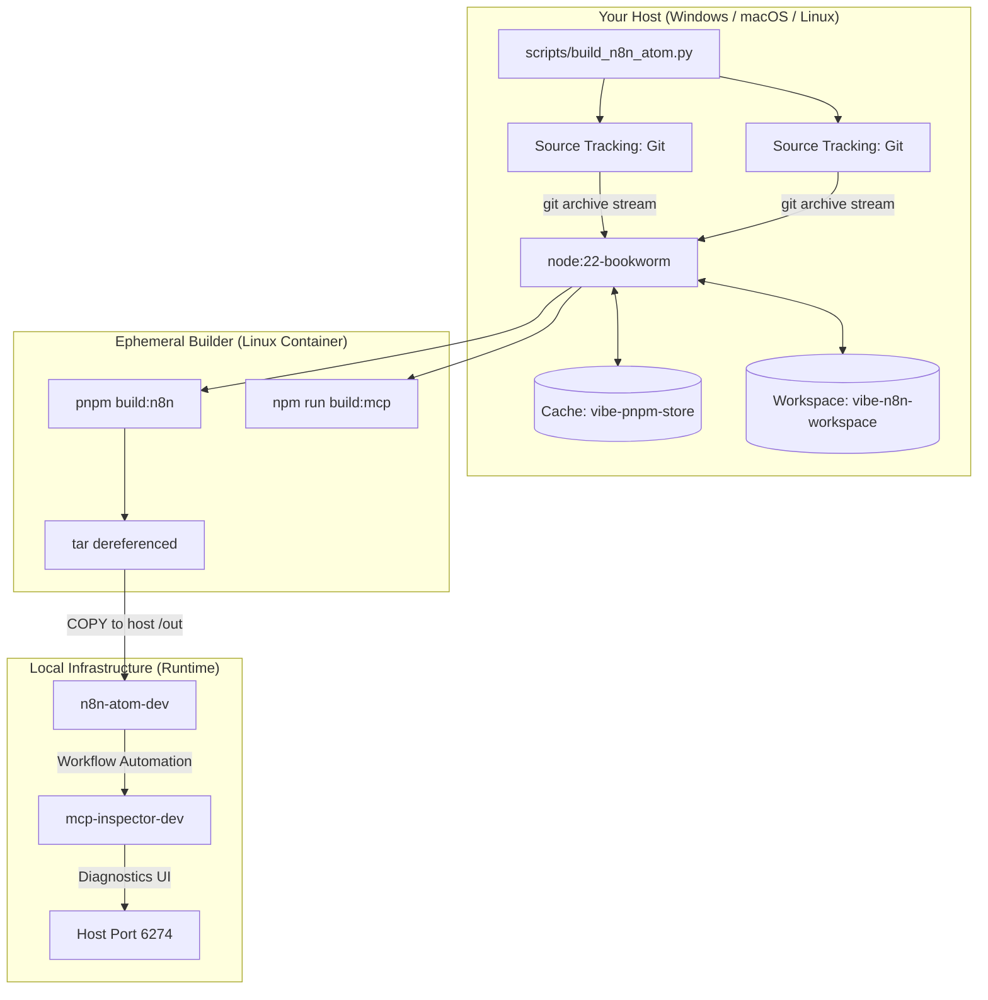
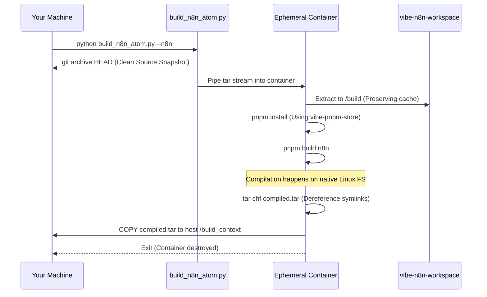

# N8N Local Development Setup (Developer Mode)

> **Just want to run n8n-atom quickly?** See [N8N_QUICKSTART.md](N8N_QUICKSTART.md) for the one-command setup using pre-built images.

This guide is for **developers** who want to:
- Build n8n-atom and MCP Inspector from source
- Understand the build pipeline and Docker architecture
- Modify the source code and test changes locally
- Learn the DevOps concepts behind containerized builds

---

## 🏗 Why Containerized Builds?

Building `n8n` from source directly on your host OS often fails due to:
1. **Long path issues** in `node_modules` (Windows NTFS limitation of 260 chars).
2. **Native build tool requirements** — `sqlite3` and `bcrypt` need Python, C++ compilers, and platform-specific headers.
3. **Shell inconsistencies** — `package.json` scripts may use Bash syntax that doesn't run on PowerShell.

By using an **Ephemeral Builder**, we run the entire compilation inside a standardized **Debian Bookworm** container. The host OS doesn't matter — the build always happens in the same Linux environment.

> **Java analogy:** This is similar to how Maven wrapper (`mvnw`) ensures everyone uses the same Maven version, except we go further and standardize the entire OS, Node.js version, and native compiler toolchain.

---

## 📐 Architecture



---

## 🛠 Prerequisites

### All Platforms
| Tool | Purpose | Install |
|---|---|---|
| **Container engine** | Build & run containers | Podman or Docker (see below) |
| **Python 3.8+** | Build orchestrator script | [python.org](https://www.python.org/) |
| **Git** | Package source code | [git-scm.com](https://git-scm.com/) |
| **8GB+ RAM** | Allocated to container engine | See platform notes below |

### Platform-Specific Notes

<details>
<summary><strong>🪟 Windows</strong></summary>

- **WSL2 required**: Podman and Docker both need WSL2. Run `wsl --install` in an admin PowerShell if you haven't already.
- **Podman Desktop**: Download from [podman-desktop.io](https://podman-desktop.io/). After install, run `podman machine init` and `podman machine start`.
- **Memory**: WSL2 defaults to 50% of system RAM. To increase, create `%USERPROFILE%\.wslconfig`:
  ```ini
  [wsl2]
  memory=8GB
  ```

</details>

<details>
<summary><strong>🍎 macOS</strong></summary>

- **Install**: `brew install podman` then `podman machine init && podman machine start`
- **Apple Silicon (M1+)**: Native ARM64 builds are supported. High-performance native I/O via `vibe-n8n-workspace`.
- **Memory**: Set via `podman machine init --memory 8192` or in Podman Desktop settings.

</details>

<details>
<summary><strong>🐧 Linux</strong></summary>

- **Install**: `sudo apt-get install podman` (Ubuntu/Debian) or `sudo dnf install podman` (Fedora)
- **SELinux**: Handled automatically. The script adds `:Z` labels where necessary.

</details>

---

## 🏆 Zero-to-Hero Windows Test Plan (From Scratch)

This section acts as a step-by-step tutorial to validating the full development environment on a brand new Windows laptop.

### 1. Install Windows Subsystem for Linux (WSL2)
1. Open PowerShell as Administrator.
2. Run: `wsl --install`
3. Restart the computer if prompted.

### 2. Configure WSL2 Memory (Crucial for Node/pnpm)
1. Press `Win + R`, type `%USERPROFILE%`, and hit Enter.
2. Create a new text file named EXACTLY `.wslconfig` in that directory.
3. Paste the following to allocate 8GB of RAM to the Docker/Podman engine:
```ini
[wsl2]
memory=8GB
```
4. Restart WSL: In PowerShell, run `wsl --shutdown`.

### 3. Install Developer Tooling
Install the following core tools:
- **Git for Windows**: Run `winget install --id Git.Git -e --source winget`
- **Python 3.10+**: Run `winget install -e --id Python.Python.3.11`
- **Podman Desktop**: Run `winget install -e --id RedHat.Podman-Desktop` (During install, initialize the Podman machine).

### 4. Clone & Setup Repository
Open PowerShell 7 and ensure you clone with submodules:
```powershell
git clone --recurse-submodules https://github.com/harryduong1212/based-workspace.git
cd based-workspace
```
Generate your private environment credentials:
```powershell
python scripts/setup_env.py
```
*(Verify that a `.env` file was created in the root).*

### 5. Execute Build Pipeline
Run the orchestrator script to compile both the frontend and backend in an isolated linux container:
```powershell
python scripts/build_n8n_atom.py --all
```
*(First run will take 5-10 minutes to download images and dependencies).*

### 6. Verify Launch Health
Bootstrap the application and verify it comes online securely via the new compose command:
```powershell
podman compose --env-file .env -f infrastructure/core/docker-compose.yaml --profile n8n-atom up -d --build
```
- **n8n Backend Health**: [http://localhost:5678/healthz](http://localhost:5678/healthz)
- **MCP Inspector UI**: [http://localhost:6274](http://localhost:6274)

---

## 🚀 Building from Source

### Basic Usage

```bash
# Build everything (n8n-atom + MCP Inspector)
python scripts/build_n8n_atom.py --all

# Build only n8n-atom
python scripts/build_n8n_atom.py --n8n

# Build only MCP Inspector
python scripts/build_n8n_atom.py --mcp
```

### Advanced Flags

| Flag | Description |
|---|---|
| `--all` | Build both projects (default if no flags given) |
| `--n8n` | Build only n8n-atom core |
| `--mcp` | Build only MCP Inspector |
| `--check` | Verify existing build integrity without rebuilding |
| `--clean` | Wipe all compiled output and reset the pnpm cache |
| `--engine {podman,docker}` | Override container engine auto-detection |

```bash
# Clean rebuild (wipes everything including persistent volumes)
python scripts/build_n8n_atom.py --clean --all

# Just check if a previous build is intact
python scripts/build_n8n_atom.py --check
```

---

## 🔍 Verification

After a successful build, verify that all artifacts exist:

```bash
python scripts/build_n8n_atom.py --check
```

**Expected output:**
```
✅ n8n Build Context Directory: FOUND
✅ n8n Portable Archive (compiled.tar): FOUND
✅ n8n Docker Entrypoint: FOUND
✅ MCP Client (dist): FOUND
✅ MCP Server (build): FOUND
✅ MCP CLI (build): FOUND
✨ All builds are healthy and ready for deployment!
```

---

## 🏗 Starting the Dev Services

Once built, deploy the full development stack. **IMPORTANT:** You must pass `--env-file .env` so the compose engine can interpolate your database credentials correctly.

```bash
# Podman
podman compose --env-file .env -f infrastructure/core/docker-compose.yaml --profile n8n-atom up -d --build

# Docker
docker compose --env-file .env -f infrastructure/core/docker-compose.yaml --profile n8n-atom up -d --build
```

### 🔌 Services Portfolio

| Service | URL | Container |
|---|---|---|
| **n8n-atom** | [http://localhost:5678](http://localhost:5678) | `n8n-atom-dev` |
| **MCP Inspector UI** | [http://localhost:6274](http://localhost:6274) | `mcp-inspector-dev` |
| **MCP Proxy Server** | `localhost:6277` (internal) | `mcp-inspector-dev` |

> **Note:** Dev mode containers use the `-dev` suffix to avoid conflicts with the quickstart mode.

---

## 🚀 Performance & Caching

The build system utilizes two persistent volumes for maximum performance:
1. **`vibe-pnpm-store`**: Shared dependency cache across all builds.
2. **`vibe-n8n-workspace`**: Native Linux filesystem (`ext4`) where the source is extracted and built. This avoids Windows NTFS I/O overhead entirely.

### Managing the Cache
-   **Standard Build**: Sub-2-minute delta rebuilds using persistent `node_modules`.
-   **Full Cache Reset**: Use the `--clean` flag to wipe volumes and restart fresh.

---

## 📖 Under the Hood — Deep Dive

### The Isolated Build Pipeline (Step by Step)

Here's exactly what happens when you run `python scripts/build_n8n_atom.py --n8n`:



### Why we use Git Archive?

Traditional volume mounts (`-v`) on Windows use the 9P or virtio-fs protocol, which is extremely slow for `npm install` (millions of small files). By using `git archive`, we stream the source code *into* a Linux volume. The builder container then reads/writes directly to its own native hard drive (`ext4`), resulting in native Linux speeds on Windows.

### Zero-Overhead Deployment

The final n8n container doesn't build anything. It simply receives the pre-compiled `compiled.tar`.
The Dockerfile uses the `ADD` instruction, which automatically extracts the archive during image creation:

```dockerfile
# In infrastructure/core/Dockerfile.n8n-atom
ADD compiled.tar /usr/local/lib/node_modules/n8n/
```

This ensures the runtime image is lean, clean, and contains exactly what was built in the isolated environment.

---

## 🔧 DevOps Glossary

Terms you'll encounter in this project, explained for backend developers:

| Term | What it means | Java/Backend analogy |
|---|---|---|
| **Container** | A lightweight, isolated process running a Linux environment | Like a JVM instance — isolated runtime |
| **Image** | A snapshot/template used to create containers | Like a `.jar` file — packaged, ready to run |
| **Volume** | Persistent storage that survives container restarts | Like an external database — data outlives the app |
| **Volume mount** | Sharing a host folder with a container | Like a `MappedByteBuffer` — shared memory between two processes |
| **Build context** | Files sent to the Docker builder | Like the classpath — what's available during compilation |
| **Ephemeral** | Temporary, created and destroyed automatically | Like `@Scope("prototype")` beans |
| **SELinux** | Linux security module that restricts file access | Like Java's `SecurityManager` |
| **Multi-arch** | Images built for multiple CPU architectures (amd64, arm64) | Like compiling for Java 11 and Java 17 at the same time |
| **GHCR** | GitHub Container Registry — hosts Docker images | Like Maven Central but for containers |
| **CI/CD** | Automated build and deploy pipeline | Like Jenkins/GitHub Actions running `mvn deploy` |

---

## 🛠️ Troubleshooting

### Build Failures

| Symptom | Platform | Solution |
|---|---|---|
| `archive/tar: unknown file mode` | Windows | Ensure `.dockerignore` is up to date |
| OOM / process killed | All | Increase container engine RAM to 8GB+ |
| Permission denied on volumes | Linux | The script auto-detects SELinux. Try `--engine docker` |
| `corepack prepare` fails | All | Pull a fresh base image: `podman pull docker.io/node:22-bookworm` |
| Very slow build on macOS | Apple Silicon | Normal — QEMU translates x86 code. Native ARM build is faster. |
| Git submodules not found | All | Run `git submodule update --init --recursive` |

### Container Startup Failures
- **Check logs**: `podman logs n8n-atom-dev` or `podman logs mcp-inspector-dev`
- **Port conflict**: Ensure nothing else is using ports 5678, 6274, or 6277
- **Quickstart conflict**: Stop the quickstart mode first (`podman compose -f infrastructure/n8n-quickstart/... down`)
