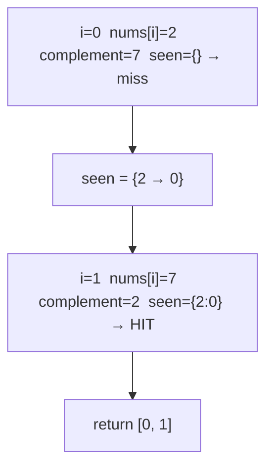

# Day 1 — Arrays & JVM Internals

> **Timebox: ~2.5 hours.** DSA practice (60m) → Deep-dive read (60m) → Recall & write-up (30m).
> If you blow past 60m on a single problem, stop, read the editorial, then re-implement from memory tomorrow.

---

## 1. Algorithmic Canvas — Arrays

### Problem 1 — [Two Sum (LC #1)](https://leetcode.com/problems/two-sum/) — *Easy*

**Target:** `O(n)` time, `O(n)` space — single-pass HashMap.
**Key insight:** at each index `i`, you don't search forward — you ask "have I already *seen* `target - nums[i]`?". Trade space for time.

```java
public int[] twoSum(int[] nums, int target) {
    Map<Integer, Integer> seen = new HashMap<>();
    for (int i = 0; i < nums.length; i++) {
        int complement = target - nums[i];
        if (seen.containsKey(complement)) {
            return new int[]{ seen.get(complement), i };
        }
        seen.put(nums[i], i);
    }
    throw new IllegalArgumentException("No two-sum solution");
}
```

**Pattern visual — HashMap state evolution (target = 9, `nums = [2,7,11,15]`):**



**Follow-ups to attempt if time permits:**
- [Two Sum II — Sorted Input (LC #167)](https://leetcode.com/problems/two-sum-ii-input-array-is-sorted/) — when input is sorted, drop the HashMap and use **two pointers** for `O(1)` space.
- [3Sum (LC #15)](https://leetcode.com/problems/3sum/) — sort + two pointers, `O(n²)`. Watch for duplicate-skip logic.
- [4Sum (LC #18)](https://leetcode.com/problems/4sum/) — same shape, one more loop.

---

### Problem 2 — [Best Time to Buy and Sell Stock (LC #121)](https://leetcode.com/problems/best-time-to-buy-and-sell-stock/) — *Easy*

**Target:** `O(n)` time, `O(1)` space — single-pass with running min.
**Key insight:** at each price, the best profit *ending today* is `today − min-seen-so-far`. Track both as you sweep.

```java
public int maxProfit(int[] prices) {
    int minPrice  = Integer.MAX_VALUE;
    int maxProfit = 0;
    for (int price : prices) {
        if (price < minPrice)              minPrice  = price;
        else if (price - minPrice > maxProfit) maxProfit = price - minPrice;
    }
    return maxProfit;
}
```

**Why this works (the invariant):** after processing index `i`, `maxProfit` is the best profit achievable by selling at any `j ≤ i`. The DP recurrence is `dp[i] = max(dp[i-1], prices[i] - min(prices[0..i]))`, but since `dp[i]` only depends on `dp[i-1]` we collapse it into two scalars.

**Follow-ups:**
- [Stock II (LC #122)](https://leetcode.com/problems/best-time-to-buy-and-sell-stock-ii/) — unlimited transactions → greedy: sum every positive delta.
- [Stock III (LC #123)](https://leetcode.com/problems/best-time-to-buy-and-sell-stock-iii/) — at most 2 transactions → 4-state DP.
- [Stock with Cooldown (LC #309)](https://leetcode.com/problems/best-time-to-buy-and-sell-stock-with-cooldown/) — state-machine DP (held / sold / rest).

---

## 2. Engineering Deep-Dive — JVM Internals

**Read:** [jvm-architecture.md](../../java-21-study-guide/04-jvm/jvm-architecture.md)

Don't passively read. Read with these **5 extraction targets** in mind — you should be able to explain each in two sentences without looking:

1. The **three JVM subsystems** (Class Loader / Runtime Data Areas / Execution Engine) — what each owns and where the boundary is.
2. **Stack vs. Heap** — what lives where, *why GC only runs on the heap*, and what happens if the stack overflows vs. the heap fills.
3. **Heap generations** (Eden / S0 / S1 / Old) and the difference between a **Minor GC** and a **Major/Full GC**.
4. **JIT tiers** (interpreter → C1 → C2) and how this manifests as the "warm-up" phase a junior engineer just sees as "weirdly slow first 30 seconds".
5. The **6 Advanced Mastery** items at the bottom of the doc: **Object Header, TLABs, Safepoints, JIT Tiers, Escape Analysis, Card Tables**. These are the staff-level differentiators.

### Recall questions (close the doc, answer in 60 seconds each)

1. A teammate writes a high-throughput Spring service on **virtual threads** and uses `synchronized` around DB calls. What breaks? *(→ pinning: the virtual thread can't unmount from its carrier OS thread; throughput collapses. Fix: `ReentrantLock`.)*
2. Production throws `OutOfMemoryError: GC overhead limit exceeded`. What does this *specifically* mean (vs. plain `Java heap space`)? What's your first diagnostic move?
3. A freshly deployed pod is 5× slower for the first ~30s, then snaps to baseline. Explain to a non-Java PM in one sentence.
4. A SaaS service allocates millions of short-lived `LineItem` objects per second. Which two JVM mechanisms (one allocation-side, one GC-side) make this cheap, and what flag-tunable can each break under?
5. You're packaging a Java function for AWS Lambda. Why is **GraalVM native-image** often preferable to a standard JVM here, and what do you trade away?

---

## 3. Day 1 Deliverables

Concrete artifacts to produce — these are what makes the day "done", not the checkboxes.

- [ ] `sprint/day01/TwoSum.java` — optimal solution + a commented-out brute-force `O(n²)` baseline + 3-line header comment stating Big-O and the invariant.
- [ ] `sprint/day01/BestTimeToBuy.java` — same shape.
- [ ] **Obsidian note (200 words):** *"Two Sum: when the HashMap approach is wrong"* — explain why sorted input flips the optimal solution to two-pointers, and the space tradeoff.
- [ ] **Obsidian note (200 words):** *"JVM warm-up explained to a PM"* — plain-English description of why the first requests after deploy are slow, and one operational mitigation (e.g. AppCDS, GraalVM native-image, or pre-warming traffic).
- [ ] **Spaced-repetition tags in Obsidian:** `#review/day-01`, `#topic/arrays`, `#topic/jvm`. You will revisit these on Day 8 and Day 15.

---

## 4. References & Further Reading

**JVM mechanics**
- [Oracle JEP 333 — ZGC](https://openjdk.org/jeps/333)
- [Oracle JEP 379 — Shenandoah (Production)](https://openjdk.org/jeps/379)
- [Aleksey Shipilëv — JVM Anatomy Quarks](https://shipilev.net/jvm/anatomy-quarks/) (the canonical deep-dive series — pick *Quark #1: Lock Coarsening*)
- [InfoQ — Advanced JVM Tuning](https://www.infoq.com/articles/Advanced-JVM-Tuning/)

**Arrays patterns**
- [NeetCode — Arrays & Hashing roadmap](https://neetcode.io/roadmap)
- [LeetCode editorial — Two Sum](https://leetcode.com/problems/two-sum/editorial/) (read *after* solving, not before)
