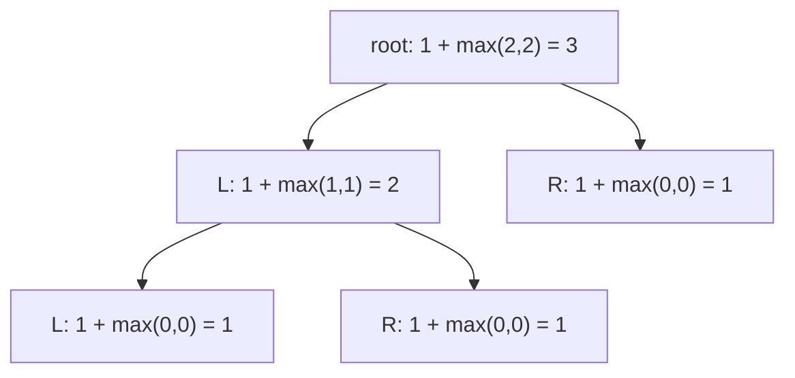

# Day 3 — Trees & Database Optimization

> **Timebox: ~2.5 hours.** DSA practice (60m) → Deep-dive read (60m) → Recall & write-up (30m).
> The deep-dive today is large (JDBC + Hibernate + PostgreSQL tuning). Skim first, deep-read the *Optimization* and *Liquibase* sections.

---

## 1. Algorithmic Canvas — Binary Trees

Tree problems are recursion problems in disguise. Internalize one mental model: **"what does this function return for one node, assuming it works correctly for the children?"** That's the entire trick.

### Problem 1 — [Invert Binary Tree (LC #226)](https://leetcode.com/problems/invert-binary-tree/) — *Easy*

**Target:** `O(n)` time, `O(h)` space (recursion stack, where `h` is tree height — `O(log n)` balanced, `O(n)` worst).
**Key insight:** at each node, swap its left and right children, then recurse. The order (swap-then-recurse vs recurse-then-swap) doesn't matter because the swap is local.

```java
public TreeNode invertTree(TreeNode root) {
    if (root == null) return null;
    TreeNode left  = invertTree(root.left);
    TreeNode right = invertTree(root.right);
    root.left  = right;
    root.right = left;
    return root;
}
```

**Iterative version (BFS) — when interviewer asks "what if the tree is a million levels deep?":**
```java
public TreeNode invertTree(TreeNode root) {
    if (root == null) return null;
    Deque<TreeNode> queue = new ArrayDeque<>();
    queue.offer(root);
    while (!queue.isEmpty()) {
        TreeNode node = queue.poll();
        TreeNode tmp = node.left; node.left = node.right; node.right = tmp;
        if (node.left  != null) queue.offer(node.left);
        if (node.right != null) queue.offer(node.right);
    }
    return root;
}
```

---

### Problem 2 — [Maximum Depth of Binary Tree (LC #104)](https://leetcode.com/problems/maximum-depth-of-binary-tree/) — *Easy*

**Target:** `O(n)` time, `O(h)` space.
**Key insight:** `depth(node) = 1 + max(depth(left), depth(right))`. Base case: `null → 0`.

```java
public int maxDepth(TreeNode root) {
    if (root == null) return 0;
    return 1 + Math.max(maxDepth(root.left), maxDepth(root.right));
}
```

**Pattern visual — post-order recursion building the answer bottom-up:**



**Follow-ups:**
- [Same Tree (LC #100)](https://leetcode.com/problems/same-tree/) — same recursion shape, but on two trees in lockstep.
- [Diameter of Binary Tree (LC #543)](https://leetcode.com/problems/diameter-of-binary-tree/) — twist: at each node return depth, but track diameter as a side-effect via an instance field. *Classic.*
- [Balanced Binary Tree (LC #110)](https://leetcode.com/problems/balanced-binary-tree/) — use `-1` sentinel to short-circuit unbalanced subtrees.

---

## 2. Engineering Deep-Dive — Database Optimization

**Read:** [jdbc.md](../../java-21-study-guide/05-ecosystem/jdbc.md)

For an AI orchestrator role, the database is rarely your bottleneck *for raw OLTP* — but it absolutely is for **multi-tenant vector search** with metadata filters and for **embedding ingestion pipelines** that backfill millions of rows. Indexing literacy is non-negotiable.

### 5 extraction targets

1. **HikariCP sizing** — the formula `connections ≈ (cores × 2) + spindles`. Why a pool of *200* is almost always wrong, and how virtual threads change (or don't change) this calculus. *Hint: the DB still has fixed connection slots.*
2. **The N+1 problem** — what it actually looks like in logs (`SELECT * FROM order_item WHERE order_id = ?` repeated N times), and the three fixes: `@EntityGraph` (join fetch), `@BatchSize` (`IN (...)` chunking), `@Fetch(SUBSELECT)`.
3. **B-Tree left-prefix rule** — composite index on `(tenant_id, status, created_at)` covers `WHERE tenant_id=X AND status=Y` but **not** `WHERE status=Y` alone. Most "why is this query slow?" tickets are this.
4. **Specialty indexes** — when to use **GIN** (JSONB containment, full-text), **BRIN** (time-series append-only), **partial** (`WHERE status='ACTIVE'`), and **covering** (`INCLUDE (...)`).
5. **Zero-downtime migrations** — Expand-and-Contract for renames, `CREATE INDEX CONCURRENTLY` to avoid table locks. The biggest senior-engineer failure mode is shipping a `RENAME COLUMN` to a 50M-row table.

### Recall questions (close the doc)

1. Your dashboard query `SELECT * FROM orders WHERE status='SHIPPED' AND created_at > NOW() - INTERVAL '1 day'` is sequential-scanning a 200M-row table. The composite index `(tenant_id, status, created_at)` exists. Why doesn't it help, and what's your fix?
2. A junior engineer drops `findAll()` into a Thymeleaf template that renders each order's items. The page goes from 80ms to 12s. Diagnose and propose two fixes.
3. You're rolling out RLS-based multi-tenancy. Why would `@Transactional(readOnly = true)` give you a measurable QPS bump on the **database** side (not just Hibernate)?
4. You need to add a non-null `tenant_id` column to a 50M-row table on a live production DB. Sketch the 5-step Expand-and-Contract plan that avoids any locking pause.
5. `EXPLAIN (ANALYZE, BUFFERS)` shows a Hash Join feeding a Nested Loop. The Hash Join is fast; the Nested Loop is the bottleneck. What does that suggest, and what would you check next?

---

## 3. Day 3 Deliverables

- [ ] `sprint/day03/InvertBinaryTree.java` — both recursive and iterative (BFS) solutions in one file with a comment on when you'd pick each.
- [ ] `sprint/day03/MaxDepth.java` — recursive solution + a comment showing the recurrence relation.
- [ ] **Obsidian note (250 words):** *"The N+1 problem and three fixes I'd actually use"* — include a snippet of how it surfaces in Hibernate's SQL logs.
- [ ] **Obsidian note (200 words):** *"B-Tree left-prefix in 60 seconds"* — small drawing of an index, three queries (one hit, one miss, one *partial* hit), explanation of each.
- [ ] **Hands-on:** spin up a local Postgres (or use the one in your project), create a `posts` table with 100k rows, run `EXPLAIN ANALYZE` on a query before and after adding an index. Paste both plans into Obsidian.
- [ ] **Spaced-repetition tags:** `#review/day-03`, `#topic/trees`, `#topic/database`, `#topic/postgres`. Revisit on Day 11 and Day 17.

---

## 4. References & Further Reading

**Trees**
- [NeetCode — Trees roadmap](https://neetcode.io/roadmap)
- [Crafting a recursion mental model — Errichto's tree DP video](https://www.youtube.com/watch?v=fAAZixBzIAI)

**Database tuning**
- [Use The Index, Luke! — canonical B-Tree guide](https://use-the-index-luke.com/)
- [PostgreSQL docs — Index Types](https://www.postgresql.org/docs/current/indexes-types.html)
- [Debezium — Reliable Microservices Data Exchange with the Outbox Pattern](https://debezium.io/blog/2019/02/19/reliable-microservices-data-exchange-with-the-outbox-pattern/)
- [Brandur Leach — *Postgres locks for engineers*](https://brandur.org/postgres-locks)
