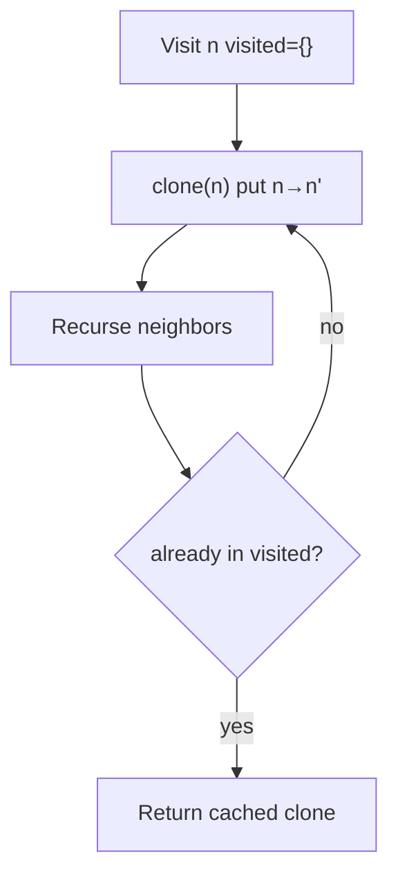

# Day 4 — Graphs & Spring Internals

> **Timebox: ~2.5 hours.** DSA practice (60m) → Deep-dive read (60m) → Recall & write-up (30m).
> Spring internals is the topic where senior interviews diverge from mid-level. Memorize the bean lifecycle order — interviewers love to probe it.

---

## 1. Algorithmic Canvas — Graphs

Almost every graph problem reduces to **BFS or DFS over a grid or adjacency list**. Pick the traversal style based on what the question is really asking:
- **"Count connected regions / components"** → DFS or BFS, doesn't matter.
- **"Shortest path in unweighted graph"** → BFS.
- **"Detect cycle in directed graph"** → DFS with three colors (white/grey/black).
- **"Topological order"** → BFS with in-degree (Kahn's) or DFS post-order.

### Problem 1 — [Number of Islands (LC #200)](https://leetcode.com/problems/number-of-islands/) — *Medium*

**Target:** `O(m·n)` time, `O(m·n)` worst-case space (DFS recursion or BFS queue).
**Key insight:** scan every cell. The first time you hit unvisited land, start a flood fill that marks the entire connected region as visited; increment the island count by 1.

```java
public int numIslands(char[][] grid) {
    int count = 0;
    int rows = grid.length, cols = grid[0].length;
    for (int r = 0; r < rows; r++) {
        for (int c = 0; c < cols; c++) {
            if (grid[r][c] == '1') {
                dfs(grid, r, c);
                count++;
            }
        }
    }
    return count;
}

private void dfs(char[][] g, int r, int c) {
    if (r < 0 || r >= g.length || c < 0 || c >= g[0].length || g[r][c] != '1') return;
    g[r][c] = '0';  // mark visited in-place; saves O(m*n) of an explicit visited[][] set
    dfs(g, r+1, c); dfs(g, r-1, c); dfs(g, r, c+1); dfs(g, r, c-1);
}
```

**Watch-outs:**
- Recursive DFS can blow the stack on a `1000×1000` all-`'1'` grid. For senior interviews, mention iterative BFS as the production-safe alternative.
- Modifying input (`grid[r][c] = '0'`) is a *trade-off* — fast but destructive. State this aloud during the interview.

---

### Problem 2 — [Clone Graph (LC #133)](https://leetcode.com/problems/clone-graph/) — *Medium*

**Target:** `O(V + E)` time, `O(V)` space.
**Key insight:** you need a `Map<Original, Clone>` to break cycles — without it you'll recurse forever on any graph with a cycle.

```java
public Node cloneGraph(Node node) {
    if (node == null) return null;
    Map<Node, Node> visited = new HashMap<>();
    return dfs(node, visited);
}

private Node dfs(Node node, Map<Node, Node> visited) {
    if (visited.containsKey(node)) return visited.get(node);
    Node copy = new Node(node.val, new ArrayList<>());
    visited.put(node, copy);                       // register BEFORE recursing
    for (Node nei : node.neighbors) {
        copy.neighbors.add(dfs(nei, visited));
    }
    return copy;
}
```

**The bug to avoid:** registering the clone *after* recursing creates an infinite loop on cycles. The `put` must happen before the neighbors are explored.

**Pattern visual — DFS with visited map:**


**Follow-ups:**
- [Pacific Atlantic Water Flow (LC #417)](https://leetcode.com/problems/pacific-atlantic-water-flow/) — multi-source BFS from both oceans inward.
- [Course Schedule (LC #207)](https://leetcode.com/problems/course-schedule/) — directed cycle detection / topological sort.
- [Word Ladder (LC #127)](https://leetcode.com/problems/word-ladder/) — BFS where edges are *implicit* (one-letter swaps).

---

## 2. Engineering Deep-Dive — Spring Framework Internals

**Read:** [spring-framework.md](../../java-21-study-guide/05-ecosystem/spring-framework.md)

The IoC container, AOP proxies, and the `@Transactional` self-invocation trap are *the* most-asked Spring questions for senior roles. If you can explain why `this.method()` skips the proxy, you're ahead of 80% of candidates.

### 5 extraction targets

1. **The 8-step bean lifecycle** — BeanDefinition → BeanFactoryPostProcessor → instantiation → DI → `@PostConstruct` → init → AOP proxy wrap → destruction. Memorize the order; interviewers love the question.
2. **JDK Dynamic Proxy vs CGLIB** — interface-based vs subclass-based. Why `final` methods can't be proxied by CGLIB, why `private` methods can't be proxied at all.
3. **`@Transactional` self-invocation** — calling `this.savedToDatabase()` from another method in the same class **bypasses the proxy** and skips transaction setup. This is the #1 "why didn't my transaction roll back?" production bug.
4. **Propagation levels** — `REQUIRED` (default join), `REQUIRES_NEW` (suspend + new tx — perfect for audit logs that must persist even on parent rollback), `NESTED` (savepoint — parent can catch and continue).
5. **Read-only transactions** — `@Transactional(readOnly = true)` switches Hibernate's flush mode to `MANUAL` and lets PG route to read replicas. Free perf win on dashboard-style services.

### Recall questions (close the doc)

1. A junior writes `@Async` on a method, calls it from within the same class, and is surprised it runs synchronously. Explain in 30 seconds. *(→ Self-invocation bypasses the proxy. Same root cause as the `@Transactional` trap.)*
2. You need an **audit log** that persists to DB even when the calling business method's transaction rolls back. Which propagation level, and what happens to the locks?
3. Spring Boot 3 moved auto-config registration from `spring.factories` to `META-INF/spring/...AutoConfiguration.imports`. *Why*? *(→ AOT/native-image friendliness; the new format is easier for GraalVM to scan at build time.)*
4. Your service has `@Transactional` on a public method that's called only from a Kafka listener. The annotation has no effect. What's the most likely cause? *(→ Listener uses a custom transaction manager / `KafkaListenerEndpointRegistry` doesn't go through the proxy; or the method is package-private.)*
5. Why can `private @Transactional` *never* work, regardless of how the method is called?

---

## 3. Day 4 Deliverables

- [ ] `sprint/day04/NumberOfIslands.java` — DFS in-place + BFS iterative variants in same file with a `// When to pick which` comment.
- [ ] `sprint/day04/CloneGraph.java` — DFS with visited map; add a `// Bug:` comment showing what happens if you register after recursing.
- [ ] **Obsidian note (300 words):** *"The Spring AOP self-invocation trap, illustrated"* — show the proxy diagram, the broken code, and the two fixes (extract to another bean, or self-inject).
- [ ] **Obsidian note (200 words):** *"Bean lifecycle in 8 numbered steps"* — write it from memory, then check against the syllabus.
- [ ] **Spaced-repetition tags:** `#review/day-04`, `#topic/graphs`, `#topic/spring`. Revisit on Day 11 and Day 18.

---

## 4. References & Further Reading

**Graphs**
- [NeetCode — Graphs roadmap](https://neetcode.io/roadmap)
- [Competitive Programmer's Handbook — graph algorithms (free PDF)](https://cses.fi/book/book.pdf) (chapters 11–14)

**Spring**
- [Spring Framework Reference — Bean Scopes & Lifecycle](https://docs.spring.io/spring-framework/reference/core/beans/factory-scopes.html)
- [Baeldung — Spring AOP vs AspectJ](https://www.baeldung.com/spring-aop-vs-aspectj)
- [Spring Reference — Transaction Propagation](https://docs.spring.io/spring-framework/reference/data-access/transaction/declarative/tx-propagation.html)
- [Vlad Mihalcea — *The best way to use the Spring Transactional annotation*](https://vladmihalcea.com/spring-transactional-annotation/)
