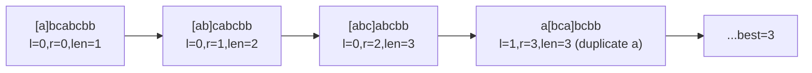

# Day 5 — Sliding Window & Microservices Resilience

> **Timebox: ~2.5 hours.** DSA practice (60m) → Deep-dive read (60m) → Recall & write-up (30m).
> Today's deep-dive is short but architecturally heavy. Spend the saved minutes drawing a Saga diagram from memory.

---

## 1. Algorithmic Canvas — Sliding Window

A sliding window is just **two pointers (`left`, `right`) that always satisfy `left ≤ right`**. The window grows by advancing `right` and shrinks by advancing `left`. The skill is recognizing when a problem is *secretly* a window problem.

**Trigger phrases:** "longest/shortest substring/subarray with property X", "max sum of subarray of size k", "minimum window containing...".

### Problem 1 — [Longest Substring Without Repeating Characters (LC #3)](https://leetcode.com/problems/longest-substring-without-repeating-characters/) — *Medium*

**Target:** `O(n)` time, `O(min(n, |alphabet|))` space.
**Key insight:** maintain a *map of `char → last-seen-index`*. When you encounter a duplicate, jump `left` to *one past* the duplicate's last-seen index — never backwards.

```java
public int lengthOfLongestSubstring(String s) {
    Map<Character, Integer> lastSeen = new HashMap<>();
    int left = 0, best = 0;
    for (int right = 0; right < s.length(); right++) {
        char c = s.charAt(right);
        if (lastSeen.containsKey(c) && lastSeen.get(c) >= left) {
            left = lastSeen.get(c) + 1;   // jump, don't decrement
        }
        lastSeen.put(c, right);
        best = Math.max(best, right - left + 1);
    }
    return best;
}
```

**Pattern visual — window evolution on `"abcabcbb"`:**


**Follow-ups:**
- [Longest Repeating Character Replacement (LC #424)](https://leetcode.com/problems/longest-repeating-character-replacement/) — window valid while `(window_size − max_freq_char) ≤ k`.
- [Minimum Window Substring (LC #76)](https://leetcode.com/problems/minimum-window-substring/) — *Hard*. Two-counter window: expand until valid, then shrink while still valid.
- [Sliding Window Maximum (LC #239)](https://leetcode.com/problems/sliding-window-maximum/) — *Hard*. Monotonic deque; comes back on Day 12.

---

### The general sliding-window template

Burn this template into muscle memory — every window problem is a variation of it:

```java
int left = 0;
SomeAggregate state = init();
int best = ...;

for (int right = 0; right < n; right++) {
    state.add(arr[right]);                  // expand
    while (!state.isValid()) {              // shrink while broken
        state.remove(arr[left++]);
    }
    best = Math.max(best, right - left + 1); // record after restoring validity
}
```

---

## 2. Engineering Deep-Dive — Microservices Resilience

**Read:** [resilience-and-patterns.md](../../java-21-study-guide/06-microservices/resilience-and-patterns.md)
**Companion deep-dive (skim today, read in full when designing the capstone):** [saga-and-comms.md](../../java-21-study-guide/06-microservices/saga-and-comms.md) — sync vs async decision matrix, the production-grade Saga orchestrator (Postgres-state-machine), and the AI-specific "inference pipeline" Saga where one step is an LLM call.

For an AI orchestrator role, *every external call is unreliable*: LLM providers go down, vector DBs throttle, embedding APIs rate-limit. Resilience4j + Outbox + Saga are the three patterns you'll mention in every system design round.

### 5 extraction targets

1. **Circuit breaker states** (CLOSED → OPEN → HALF-OPEN) and the typical knobs: failure rate threshold, slow-call threshold, wait duration, permitted-calls-in-half-open. Be able to sketch the state machine.
2. **Bulkhead vs circuit breaker** — bulkhead *prevents* one slow downstream from starving threads for unrelated work; circuit breaker *stops calls* to a known-bad downstream.
3. **Saga: choreography vs orchestration** — choreography (event-driven, decentralized, hard to debug) vs orchestration (central coordinator, easier observability, single point to harden). Pick orchestration when steps > 4.
4. **The dual-write problem** — committing to DB *and* publishing to Kafka cannot be atomic. The naïve "save then publish" leaks events on broker downtime; "publish then save" leaks events on DB constraint violations.
5. **Transactional Outbox + Debezium CDC** — solves dual-write by writing the event into an `outbox` table inside the same DB transaction, then a CDC worker tails the WAL and publishes to Kafka. This is *the* answer to "how do you reliably emit events?".

### Recall questions (close the doc)

1. Your `EmbeddingService` calls OpenAI's API. OpenAI starts returning 429s. Without a circuit breaker, what cascades? With one, what's the user-visible behavior, and what fallback do you wire up?
2. A teammate proposes: "Wrap every outbound HTTP call in a 30-second `@Retryable(maxAttempts=5)`." What's wrong with this in a chain of 4 microservices?
3. Saga choreography vs orchestration — name two operational reasons (*not* design philosophy) you'd push for orchestration in a payment-refund flow.
4. Your team writes `orderRepo.save(order); kafka.send(event);` and ships it. A week later, support tickets pile up about "ghost orders" (in DB but not in Kafka). Diagnose, then explain the Outbox fix in three sentences.
5. Why is the *CDC* part of "Outbox + CDC" load-bearing? What goes wrong if you instead poll the `outbox` table from a Spring `@Scheduled` job?

---

## 3. Day 5 Deliverables

- [ ] `sprint/day05/LongestSubstring.java` — your one solution + a comment block listing 3 sibling problems and how the template adapts.
- [ ] **Obsidian note (300 words):** *"The sliding window template, annotated"* — paste the template, then walk through how it specializes for "longest substring without repeats" vs "minimum window substring" vs "longest repeating character replacement".
- [ ] **Obsidian note (300 words):** *"Outbox + CDC, drawn"* — single sequence diagram showing OrderService writing to DB (orders + outbox), Debezium tailing WAL, publishing to Kafka. Annotate the failure modes that this pattern survives.
- [ ] **Hands-on:** add a `Resilience4j` `@CircuitBreaker` to one of your existing service methods (or a throwaway one in `sprint/day05/`). Trigger the breaker by injecting a deliberate exception in a unit test. Verify state transitions in metrics.
- [ ] **End-of-week-1 reflection:** in Obsidian, write one paragraph on which of Days 1–5 felt *weakest* and schedule a 30-min review block on Day 8 (which has slack budget).
- [ ] **Spaced-repetition tags:** `#review/day-05`, `#topic/sliding-window`, `#topic/microservices`. Revisit on Day 12 and Day 19.

---

## 4. References & Further Reading

**Sliding window**
- [NeetCode — Sliding Window roadmap](https://neetcode.io/roadmap)
- [LeetCode editorial — Minimum Window Substring](https://leetcode.com/problems/minimum-window-substring/editorial/)

**Resilience & distributed patterns**
- [Resilience4j — Circuit Breaker docs](https://resilience4j.readme.io/docs/circuitbreaker)
- [Microservices.io — Saga pattern (Chris Richardson)](https://microservices.io/patterns/data/saga.html)
- [Microservices.io — Transactional Outbox pattern](https://microservices.io/patterns/data/transactional-outbox.html)
- [Debezium blog — Reliable Microservices Data Exchange with the Outbox Pattern](https://debezium.io/blog/2019/02/19/reliable-microservices-data-exchange-with-the-outbox-pattern/)
- [Sam Newman — *Building Microservices* (book, 2nd ed.)](https://samnewman.io/books/building_microservices_2nd_edition/)
