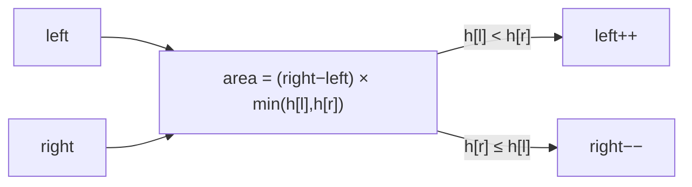

# Day 6 — Two Pointers & OAuth 2.0 / JWT

> **Timebox: ~2.5 hours.** DSA practice (60m) → Deep-dive read (60m) → Recall & write-up (30m).
> Week 2 starts. Today the deep-dive matters more than the DSA — auth questions are senior-interview staples.

---

## 1. Algorithmic Canvas — Two Pointers

The two-pointer family is the *ranges* family of sliding window: instead of `[left, right]` always moving forward, the two ends *converge*. Trigger phrase: **"sorted array"** + **"find pair / triple / range"**. If the input isn't sorted but the problem allows reordering, *sort first* — `O(n log n)` plus `O(n)` two-pointer beats `O(n²)` brute force.

### Problem 1 — [Valid Palindrome (LC #125)](https://leetcode.com/problems/valid-palindrome/) — *Easy*

**Target:** `O(n)` time, `O(1)` space.
**Key insight:** start one pointer at each end, walk inward, *skip non-alphanumerics*, compare lowercased chars.

```java
public boolean isPalindrome(String s) {
    int left = 0, right = s.length() - 1;
    while (left < right) {
        while (left < right && !Character.isLetterOrDigit(s.charAt(left)))  left++;
        while (left < right && !Character.isLetterOrDigit(s.charAt(right))) right--;
        if (Character.toLowerCase(s.charAt(left)) != Character.toLowerCase(s.charAt(right))) {
            return false;
        }
        left++; right--;
    }
    return true;
}
```

**Watch-out:** the `left < right` guard *inside* the inner skip-loops is critical; without it, an all-punctuation string like `".,;"` walks the pointers off the ends.

---

### Problem 2 — [Container With Most Water (LC #11)](https://leetcode.com/problems/container-with-most-water/) — *Medium*

**Target:** `O(n)` time, `O(1)` space.
**Key insight:** width × min(height). Move the *shorter* wall inward — moving the taller one can only ever *decrease* width without raising the min.

```java
public int maxArea(int[] height) {
    int left = 0, right = height.length - 1;
    int best = 0;
    while (left < right) {
        int h = Math.min(height[left], height[right]);
        best = Math.max(best, h * (right - left));
        if (height[left] < height[right]) left++;
        else                              right--;
    }
    return best;
}
```

**Pattern visual — converging pointers:**


**Why moving the shorter wall is optimal (the proof you should be able to give):** the area is bounded by the shorter wall × current width. If we move the *taller* wall inward, the new min is *at most* the old shorter wall, and the width is strictly smaller — the area cannot improve. So moving the taller wall is always dominated.

**Follow-ups:**
- [3Sum (LC #15)](https://leetcode.com/problems/3sum/) — sort, then for each `i`, two-pointer the rest. Watch the duplicate-skip logic.
- [Trapping Rain Water (LC #42)](https://leetcode.com/problems/trapping-rain-water/) — *Hard*. Two-pointer with running `leftMax`/`rightMax`.

---

## 2. Engineering Deep-Dive — OAuth 2.0 & JWT

**Read:** [oauth2-and-jwt.md](../../java-21-study-guide/07-security-and-identity/oauth2-and-jwt.md)

OAuth/OIDC literacy is the ticket to staff-level security conversations. PKCE in particular comes up because every modern auth flow for SPAs and mobile uses it.

### 5 extraction targets

1. **Authorization Code + PKCE** — what `code_verifier` and `code_challenge` are, *why* the SHA-256 hash matters (so an attacker who intercepts the auth code can't redeem it), when to use this flow vs Client Credentials.
2. **Client Credentials** — M2M flow, no user. Caching tokens until `expires_in − 5min` to avoid hammering the auth server.
3. **Token Exchange (RFC 8693)** — Service A holds a user token, needs to call Service B *as* the user. Exchanges its token for a B-scoped token at the auth server. Crucial for downstream service auth in microservices.
4. **JWS vs JWE** — JWS is **signed** (anyone can read the payload — *never put PII inside*). JWE is **encrypted**. Nested JWT = signed-then-encrypted.
5. **JWT signing algorithms** — `RS256` (RSA, large keys, common) vs `ES256` (ECDSA P-256, smaller and faster, preferred for new systems). HS256 (symmetric) is dangerous for distributed systems because every verifier holds the signing key.

### Recall questions (close the doc)

1. A frontend dev says "PKCE is just for mobile — our SPA doesn't need it". What's wrong with that, and what specifically does PKCE prevent that a normal Authorization Code flow doesn't? *(→ Code interception attack on public clients. PKCE binds the auth code to a secret only the original requester knows.)*
2. Your service receives a JWS access token in `Authorization: Bearer ...`. You log the entire header (including the bearer) to your APM tool. Why is this a serious leak even though the token is "signed, not encrypted"?
3. Service A (calling on behalf of User U) needs to call Service B. You consider three options: (a) forward A's user token to B, (b) issue B a service token via Client Credentials, (c) Token Exchange. When is each appropriate?
4. Why does putting `email` and `phone` in a JWS payload violate compliance for a healthcare app, even though the token is signed and "tamper-proof"?
5. You're rotating your JWT signing key. Old tokens still in flight need to validate. Sketch the JWKS-endpoint approach that lets you rotate without invalidating live sessions.

---

## 3. Day 6 Deliverables

- [ ] `sprint/day06/ValidPalindrome.java` — solution + a `// Edge cases:` comment listing the all-punctuation case, empty string, single char.
- [ ] `sprint/day06/ContainerWithMostWater.java` — solution + the *proof* that moving the shorter wall is optimal as a comment.
- [ ] **Obsidian note (300 words):** *"PKCE in 90 seconds, with the attack it prevents"* — single sequence diagram + 3-sentence narrative of the interception attack PKCE blocks.
- [ ] **Obsidian note (200 words):** *"JWS vs JWE vs Nested JWT — when to reach for each"* — and write down the exact list of fields you'd refuse to put in a JWS for a SaaS chatbot.
- [ ] **Hands-on (optional but valuable):** spin up Keycloak in Podman (`podman run -p 8080:8080 quay.io/keycloak/keycloak`), configure a confidential client, decode the resulting JWT at [jwt.io](https://jwt.io) and identify each claim.
- [ ] **Spaced-repetition tags:** `#review/day-06`, `#topic/two-pointers`, `#topic/oauth`, `#topic/jwt`. Revisit on Day 13 and Day 19.

---

## 4. References & Further Reading

**Two pointers**
- [NeetCode — Two Pointers roadmap](https://neetcode.io/roadmap)
- [LeetCode editorial — Container With Most Water](https://leetcode.com/problems/container-with-most-water/editorial/)

**Auth**
- [RFC 7636 — Proof Key for Code Exchange (PKCE)](https://datatracker.ietf.org/doc/html/rfc7636)
- [RFC 8693 — OAuth 2.0 Token Exchange](https://datatracker.ietf.org/doc/html/rfc8693)
- [RFC 7515 — JSON Web Signature (JWS)](https://datatracker.ietf.org/doc/html/rfc7515)
- [RFC 7516 — JSON Web Encryption (JWE)](https://datatracker.ietf.org/doc/html/rfc7516)
- [Okta — *PASETO vs JWT vs Macaroon* (deep comparison)](https://developer.okta.com/blog/2019/10/17/a-thorough-introduction-to-paseto-macaroon-and-jwt)
- [OAuth 2.0 Threat Model (RFC 6819)](https://datatracker.ietf.org/doc/html/rfc6819) — the authoritative list of attacks you should be able to name.
