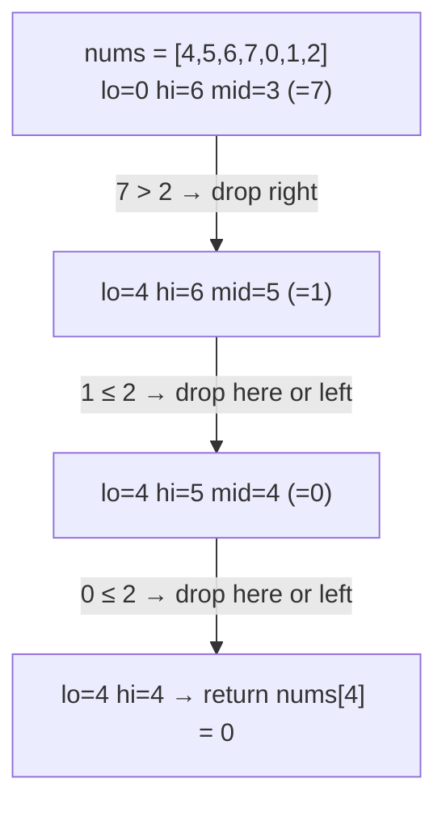

# Day 7 — Binary Search & Multi-Tenancy (RLS)

> **Timebox: ~2.5 hours.** DSA practice (60m) → Deep-dive read (60m) → Recall & write-up (30m).
> Multi-tenancy is the single most-asked architecture question for AI orchestrator roles — every SaaS chatbot is multi-tenant. Don't shortchange it.

---

## 1. Algorithmic Canvas — Binary Search

Binary search is `O(log n)`, but the value isn't the log — it's that *most* "find a threshold" or "minimize/maximize subject to constraint" problems hide a binary search inside them. The **template** matters more than the canonical example.

### Problem 1 — [Binary Search (LC #704)](https://leetcode.com/problems/binary-search/) — *Easy*

**Target:** `O(log n)` time, `O(1)` space.
**Key insight:** the off-by-one is the entire problem. Use **half-open intervals** `[lo, hi)` to make boundary handling consistent.

```java
public int search(int[] nums, int target) {
    int lo = 0, hi = nums.length;          // half-open [lo, hi)
    while (lo < hi) {
        int mid = lo + (hi - lo) / 2;      // avoids overflow on huge arrays
        if      (nums[mid] == target) return mid;
        else if (nums[mid] <  target) lo = mid + 1;
        else                          hi = mid;
    }
    return -1;
}
```

**Why `lo + (hi - lo) / 2` and not `(lo + hi) / 2`?** The latter overflows when `lo + hi > Integer.MAX_VALUE`. This is an *actual* bug that lived in `java.util.Arrays.binarySearch` until 2006.

---

### Problem 2 — [Find Minimum in Rotated Sorted Array (LC #153)](https://leetcode.com/problems/find-minimum-in-rotated-sorted-array/) — *Medium*

**Target:** `O(log n)` time, `O(1)` space.
**Key insight:** the array has *one* "drop" (the rotation point). At each step, compare `nums[mid]` to `nums[hi]` to decide which half contains the drop.

```java
public int findMin(int[] nums) {
    int lo = 0, hi = nums.length - 1;       // closed interval here
    while (lo < hi) {
        int mid = lo + (hi - lo) / 2;
        if (nums[mid] > nums[hi]) lo = mid + 1;  // drop is to the right
        else                      hi = mid;       // drop is at mid or left
    }
    return nums[lo];
}
```

**Pattern visual — "which half contains the drop?":**


**Follow-ups:**
- [Search in Rotated Sorted Array (LC #33)](https://leetcode.com/problems/search-in-rotated-sorted-array/) — same trick + a target-comparison step.
- [Koko Eating Bananas (LC #875)](https://leetcode.com/problems/koko-eating-bananas/) — *binary search on the answer*. The classic "is this rate feasible?" pattern.
- [Median of Two Sorted Arrays (LC #4)](https://leetcode.com/problems/median-of-two-sorted-arrays/) — *Hard*. Binary search on partition points.

### The "binary search on the answer" pattern

When the problem asks "what's the minimum X such that condition Y holds?" — and `condition Y` is *monotone* in X — binary-search the answer space:
```
lo = lower bound on X
hi = upper bound on X
while lo < hi:
    mid = lo + (hi - lo) / 2
    if feasible(mid): hi = mid     // shrink toward smaller
    else:             lo = mid + 1
return lo
```
Half of "Hard"-tagged search problems on LeetCode are this template. Memorize it.

---

## 2. Engineering Deep-Dive — Multi-Tenancy & RLS

**Read:** [multi-tenancy.md](../../java-21-study-guide/07-security-and-identity/multi-tenancy.md)

Every interview for an AI orchestrator role will probe this — because every customer-facing chatbot is multi-tenant. The cost-vs-isolation trade-off and how to **enforce isolation at the database level** (not in Java) are the senior differentiators.

### 5 extraction targets

1. **The 3 isolation models** — DB-per-tenant (highest isolation, highest cost), schema-per-tenant (middle), shared-schema with `tenant_id` column (cheapest, riskiest). Be ready to argue trade-offs in cost, blast radius, and cross-tenant analytics.
2. **Why "just add `WHERE tenant_id = X`" is not enough** — one missed clause leaks all data. Senior engineers move enforcement *below* application code.
3. **PostgreSQL Row-Level Security (RLS)** — a `CREATE POLICY` that the kernel applies before *any* query touches the table. Combined with `current_setting('app.current_tenant')`, you get bulletproof isolation even if a developer forgets the WHERE.
4. **Spring + RLS plumbing** — using a Hibernate `StatementInspector` (or `Interceptor`) to inject `SET LOCAL app.current_tenant = '<uuid>'` before every statement. The `tenant_id` itself comes from a `ThreadLocal` populated by a Servlet filter that reads the JWT.
5. **RBAC vs ABAC** — RBAC ties permissions to *roles* (fast, simple, brittle when rules go dynamic); ABAC evaluates against *attributes of user, resource, environment* (`@PreAuthorize("@sec.canDelete(authentication, #order)")`). For chatbots: tenant isolation = RBAC-ish; per-document permissions = ABAC.

### Recall questions (close the doc)

1. Your team uses shared-schema multi-tenancy. A new dev's `findByStatus(String status)` query forgets the tenant filter. With RLS configured correctly, what happens? Without it, what happens?
2. Why is `SET LOCAL` (vs `SET`) critical when injecting the tenant variable? *(→ `SET LOCAL` scopes to the current transaction; `SET` persists for the entire connection — and connection pools recycle connections across tenants.)*
3. A SaaS customer demands **dedicated database** isolation. You're currently shared-schema. Sketch the migration plan and the Spring-side changes needed (multi-tenant `DataSource` resolution).
4. RBAC vs ABAC: a feature ships where "any user can edit a document if (they own it) OR (they're an admin in its workspace) AND (workspace is not in read-only mode)". Why does this break RBAC, and how does ABAC handle it cleanly?
5. Vector DB multi-tenancy: in pgvector with shared schema, would you (a) put `tenant_id` in `metadata` JSONB, (b) put it as a top-level column, or (c) use separate tables per tenant? What changes for query planning?

---

## 3. Day 7 Deliverables

- [ ] `sprint/day07/BinarySearch.java` — half-open template solution + a comment showing the canonical overflow bug fix.
- [ ] `sprint/day07/FindMinRotated.java` — solution + a comment listing the three "rotated" variants (LC #33, #81, #153) and how the comparison changes.
- [ ] **Obsidian note (300 words):** *"Binary search on the answer — the template that unlocks 30% of Hard problems"* — paste the template, then walk through Koko Eating Bananas and Capacity to Ship Packages.
- [ ] **Obsidian note (350 words):** *"Multi-tenant isolation — three models and which I'd pick for an AI chatbot SaaS"* — include a one-paragraph defense of RLS and the `StatementInspector` pattern.
- [ ] **Hands-on:** create a tiny Postgres table, enable RLS, write 2 SELECTs as 2 different `SET app.current_tenant` values, prove isolation. Paste the session transcript into Obsidian.
- [ ] **Spaced-repetition tags:** `#review/day-07`, `#topic/binary-search`, `#topic/multi-tenancy`, `#topic/rls`. Revisit on Day 14 and Day 20.

---

## 4. References & Further Reading

**Binary search**
- [NeetCode — Binary Search roadmap](https://neetcode.io/roadmap)
- [LeetCode editorial — Find Minimum in Rotated Sorted Array](https://leetcode.com/problems/find-minimum-in-rotated-sorted-array/editorial/)
- [Errichto — Binary search variants (YouTube)](https://www.youtube.com/watch?v=GU7DpgHINWQ)

**Multi-tenancy & RLS**
- [PostgreSQL docs — Row Security Policies](https://www.postgresql.org/docs/current/ddl-rowsecurity.html)
- [Microsoft — Multi-tenant SaaS database tenancy patterns](https://learn.microsoft.com/en-us/azure/azure-sql/database/saas-tenancy-app-design-patterns)
- [Vlad Mihalcea — Hibernate multi-tenancy](https://vladmihalcea.com/hibernate-multitenancy/)
- [AWS — *SaaS storage strategies*](https://docs.aws.amazon.com/whitepapers/latest/saas-architecture-fundamentals/saas-storage-strategies.html)
