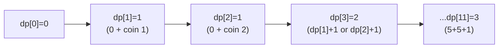

# Day 8 — Dynamic Programming & Containerization (Podman)

> **Timebox: ~2.75 hours.** DSA practice (75m — DP needs more time) → Deep-dive read (60m) → Recall & write-up (30m).
> **Built-in slack:** the original sprint plan flagged this day for end-of-week-1 review. If Days 1–5 left weak spots, spend 30m revisiting your weakest topic *before* starting today's DSA.

---

## 1. Algorithmic Canvas — Dynamic Programming

DP is the topic that breaks most candidates. The trick isn't *solving* DP problems — it's **recognizing them**. A problem is DP if it has both:
1. **Optimal substructure** — the answer can be built from sub-answers.
2. **Overlapping subproblems** — naïve recursion solves the same sub-question multiple times.

The two-step recipe: (a) write the recurrence as if memory is free (top-down memoization), (b) flip to bottom-up tabulation when space matters.

### Problem 1 — [Climbing Stairs (LC #70)](https://leetcode.com/problems/climbing-stairs/) — *Easy*

**Target:** `O(n)` time, `O(1)` space (it's just Fibonacci in a costume).
**Recurrence:** `f(n) = f(n-1) + f(n-2)` — at step `n` you arrived from either `n-1` (one step) or `n-2` (two steps).

```java
public int climbStairs(int n) {
    if (n <= 2) return n;
    int prev2 = 1, prev1 = 2;
    for (int i = 3; i <= n; i++) {
        int curr = prev1 + prev2;
        prev2 = prev1;
        prev1 = curr;
    }
    return prev1;
}
```

The `O(1)` space is the *senior* signal. Always ask yourself: *do I really need the whole `dp[]` array, or just the last two values?*

---

### Problem 2 — [Coin Change (LC #322)](https://leetcode.com/problems/coin-change/) — *Medium*

**Target:** `O(amount × |coins|)` time, `O(amount)` space.
**Recurrence:** `dp[a] = 1 + min(dp[a - c])` for each coin `c ≤ a`. Initialize `dp[0] = 0`, everything else to `amount + 1` (sentinel for "impossible").

```java
public int coinChange(int[] coins, int amount) {
    int[] dp = new int[amount + 1];
    Arrays.fill(dp, amount + 1);          // sentinel: any real answer is < this
    dp[0] = 0;
    for (int a = 1; a <= amount; a++) {
        for (int c : coins) {
            if (c <= a) dp[a] = Math.min(dp[a], dp[a - c] + 1);
        }
    }
    return dp[amount] > amount ? -1 : dp[amount];
}
```

**Pattern visual — bottom-up table fills (`coins=[1,2,5], amount=11`):**


**Common mistake:** flipping the loop order to `for c in coins: for a in 1..amount` solves a *different* problem (Coin Change 2 — *number of ways*, not minimum coins). The order matters because it determines whether you allow each coin once or unlimited.

**Follow-ups:**
- [House Robber (LC #198)](https://leetcode.com/problems/house-robber/) — same `O(1)`-space trick, recurrence `dp[i] = max(dp[i-1], dp[i-2] + nums[i])`.
- [Longest Increasing Subsequence (LC #300)](https://leetcode.com/problems/longest-increasing-subsequence/) — `O(n²)` DP, then the `O(n log n)` patience-sorting variant.
- [Word Break (LC #139)](https://leetcode.com/problems/word-break/) — `dp[i] = true` if any prefix break works.

---

## 2. Engineering Deep-Dive — Containerization & Podman

**Read:** [containerization.md](../../java-21-study-guide/08-infrastructure/containerization.md)

For an AI orchestrator role, container literacy = ability to ship a Spring Boot 3 app to Cloud Run / Lambda with **fast cold starts**, **minimal attack surface**, and **JVM container-awareness flags** set correctly.

### 5 extraction targets

1. **Multi-stage Dockerfile** — build stage (Maven + JDK) → JRE-link stage (`jlink` to strip unused modules) → runtime stage (`debian-slim` + non-root user). The 400MB → ~100MB drop comes from `jlink` alone.
2. **`jlink` module list** — what `java.base, java.sql, java.naming, java.management, java.net.http, jdk.crypto.ec` cover, and how `jdeps` finds the rest. Spring Boot apps typically need 12–18 modules.
3. **JVM container-awareness flags** — `-XX:MaxRAMPercentage=75.0` (don't hardcode `-Xmx`; let it scale with the container's memory limit), `-XX:+UseZGC` for low-latency, `-XX:+ZGenerational` for Java 21.
4. **Rootless Podman vs Docker** — daemonless + user-namespace mapping means a container breakout lands the attacker as the unprivileged host user, not root. Big security delta for shared developer workstations and CI runners.
5. **GraalVM native-image trade-off** — milliseconds-to-start vs lost JIT optimization potential. Best for Lambda/Cloud Run cold-start workloads; *worse* for steady-state throughput-bound services where JIT C2 wins.

### Recall questions (close the doc)

1. A teammate sets `-Xmx2g` on a container with a 2GB memory limit. The container OOM-kills under load. Why, and what's the senior fix? *(→ The JVM also uses non-heap memory: Metaspace, code cache, direct buffers, native libs. `-Xmx2g` leaves zero headroom. Use `-XX:MaxRAMPercentage=75.0`.)*
2. Your image is 480MB. Your colleague's is 95MB. Both run Spring Boot 3 with Java 21. Name three changes that close the gap.
3. Why is `COPY pom.xml .` followed by `RUN mvn dependency:go-offline` *before* `COPY src` a non-trivial speedup in CI? *(→ Layer caching: dependencies change rarely, source changes constantly. Without this, every code change re-downloads dependencies.)*
4. Your security team mandates "no root in containers". You add `USER appuser`, but `bind` to port 80 fails. What's happening, and what's the fix? *(→ Non-root can't bind ports < 1024. Either bind to 8080 + use a load balancer or `setcap CAP_NET_BIND_SERVICE`.)*
5. GraalVM native-image vs JIT JVM for an LLM gateway service that handles 5K RPS sustained: which would you pick and why? *(→ JIT — sustained throughput benefits from C2 optimizations + virtual threads; native-image's main win is cold start, irrelevant here. But for the embedding-batch *Lambda function* that runs nightly, native-image is the right choice.)*

---

## 3. Day 8 Deliverables

- [ ] `sprint/day08/ClimbingStairs.java` — `O(1)`-space iterative solution + a comment showing the naïve `O(2^n)` recursive version it improves on.
- [ ] `sprint/day08/CoinChange.java` — bottom-up tabulation + a comment explaining why nested loop order matters.
- [ ] **Obsidian note (300 words):** *"How I recognize a DP problem in 60 seconds"* — write your own checklist (overlapping subproblems? optimal substructure? state representation?) and apply it to 3 problems from this week.
- [ ] **Obsidian note (300 words):** *"The optimized Java 21 container Dockerfile, annotated"* — copy the multi-stage Dockerfile from the syllabus into your note and annotate every line with *why*.
- [ ] **Hands-on:** build the multi-stage Dockerfile against a tiny Spring Boot Hello World. Compare `podman images` size before and after `jlink`. Note both numbers.
- [ ] **Slack-budget review (carry-over):** if Days 1–5 had topics that didn't stick, do a 30m focused recall now using your spaced-repetition tags. Don't skip.
- [ ] **Spaced-repetition tags:** `#review/day-08`, `#topic/dp`, `#topic/containers`. Revisit on Day 15 and Day 20.

---

## 4. References & Further Reading

**Dynamic programming**
- [NeetCode — DP roadmap](https://neetcode.io/roadmap)
- [Errichto — DP playlist (YouTube, 8 episodes)](https://www.youtube.com/playlist?list=PLl0KD3g-oDOHpWRyyGBUJ9jmul0lUOD80)
- [LeetCode editorial — Coin Change](https://leetcode.com/problems/coin-change/editorial/)

**Containers**
- [Docker — Multi-stage build best practices](https://docs.docker.com/build/building/multi-stage/)
- [Red Hat — *What are rootless containers?*](https://www.redhat.com/en/topics/containers/what-is-rootless-containers)
- [Spring Boot — Native image support](https://docs.spring.io/spring-boot/reference/packaging/native-image/index.html)
- [GraalVM docs — Native image](https://www.graalvm.org/latest/reference-manual/native-image/)
- [Adoptium / Eclipse Temurin — *JVM heap sizing in containers*](https://adoptium.net/blog/2021/02/jvm-tuning/)
