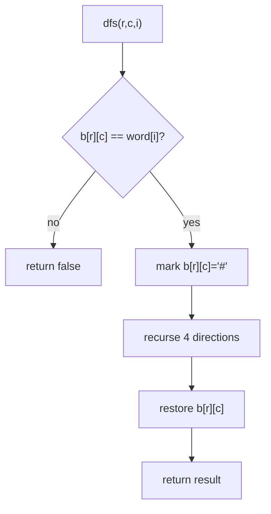

# Day 9 — Backtracking & Observability (Distributed Tracing)

> **Timebox: ~2.5 hours.** DSA practice (60m) → Deep-dive read (60m) → Recall & write-up (30m).
> Backtracking is "controlled brute force". The senior signal is **pruning** — you'll get partial credit for any working solution, but full credit only if you cut branches early.

---

## 1. Algorithmic Canvas — Backtracking

The backtracking template is one method:
```
backtrack(state):
    if state is a complete answer:  record(state); return
    if state is doomed:              return            // ← pruning lives here
    for each choice in candidates:
        apply(choice)                                  // mutate
        backtrack(...)
        undo(choice)                                   // restore
```
The "**undo**" step is what makes it backtracking, not just DFS. Senior interviews check that you keep one shared mutable state and undo cleanly, instead of allocating fresh state per recursion (which is wasteful and a junior tell).

### Problem 1 — [Combinations (LC #77)](https://leetcode.com/problems/combinations/) — *Medium*

**Target:** `O(C(n,k) × k)` time, `O(k)` recursion depth.
**Key insight:** at each step, *choose a starting index ≥ the last chosen one* — this prevents permutations of the same combination.

```java
public List<List<Integer>> combine(int n, int k) {
    List<List<Integer>> result = new ArrayList<>();
    backtrack(1, n, k, new ArrayDeque<>(), result);
    return result;
}

private void backtrack(int start, int n, int k, Deque<Integer> path, List<List<Integer>> out) {
    if (path.size() == k) { out.add(new ArrayList<>(path)); return; }
    // Pruning: if remaining slots > remaining candidates, abort early
    int remaining = k - path.size();
    int last      = n - remaining + 1;
    for (int i = start; i <= last; i++) {
        path.push(i);
        backtrack(i + 1, n, k, path, out);
        path.pop();
    }
}
```

**The pruning that matters:** without `last = n - remaining + 1`, you waste branches where there aren't enough candidates left to fill the result. This cuts the runtime in half for `n=20, k=10`.

---

### Problem 2 — [Word Search (LC #79)](https://leetcode.com/problems/word-search/) — *Medium*

**Target:** `O(m·n·4^L)` worst case where `L = word.length`. With pruning, much faster in practice.
**Key insight:** DFS from every cell. Mutate the grid (`board[r][c] = '#'`) to mark visited, *restore on backtrack*. The four recursive calls in the OR short-circuit — if any returns true, you stop.

```java
public boolean exist(char[][] board, String word) {
    int rows = board.length, cols = board[0].length;
    for (int r = 0; r < rows; r++) {
        for (int c = 0; c < cols; c++) {
            if (dfs(board, r, c, word, 0)) return true;
        }
    }
    return false;
}

private boolean dfs(char[][] b, int r, int c, String w, int i) {
    if (i == w.length()) return true;
    if (r < 0 || r >= b.length || c < 0 || c >= b[0].length) return false;
    if (b[r][c] != w.charAt(i)) return false;

    char tmp = b[r][c];
    b[r][c] = '#';                     // mark visited (mutate)
    boolean found = dfs(b,r+1,c,w,i+1) || dfs(b,r-1,c,w,i+1)
                 || dfs(b,r,c+1,w,i+1) || dfs(b,r,c-1,w,i+1);
    b[r][c] = tmp;                     // ← THE undo step
    return found;
}
```

**Pattern visual — explore-mark-undo:**


**Follow-ups:**
- [Subsets (LC #78)](https://leetcode.com/problems/subsets/) — same shape, but record at *every* node, not just leaves.
- [Permutations (LC #46)](https://leetcode.com/problems/permutations/) — backtracking with a `used[]` array.
- [N-Queens (LC #51)](https://leetcode.com/problems/n-queens/) — *Hard*. Three constraint sets (column, diagonal, anti-diagonal) for `O(1)` validity checks. The classic.

---

## 2. Engineering Deep-Dive — Distributed Tracing & Observability

**Read:** [observability.md](../../java-21-study-guide/08-infrastructure/observability.md)

For an AI orchestrator, observability is *life-critical*: a single chatbot turn fans out to 5–10 services (gateway → auth → vector DB → LLM → tool calls). Without correlation IDs, you can't reconstruct what went wrong on a customer's failed request.

### 5 extraction targets

1. **W3C `traceparent` header** vs ad-hoc `X-Request-ID` — why W3C is the new standard, what the format encodes (`version-trace_id-parent_id-flags`), and why every service must propagate it.
2. **MDC (Mapped Diagnostic Context)** — Logback's ThreadLocal map that the `%X{correlationId}` log pattern reads from. Servlet filter populates it at request entry; **must** clear in `finally` or you leak across thread-pool reuse.
3. **The MDC + virtual threads gotcha** — VTs are short-lived and don't share thread-pool reuse the same way, but if you use *carrier* threads for auxiliary work (or any custom thread pool), MDC clearing is still mandatory. Micrometer Tracing handles this; raw SLF4J doesn't.
4. **Outbound propagation** — the MDC value must be re-attached to outbound `WebClient`/`RestTemplate` requests as a header. Spring Cloud Sleuth (now Micrometer Tracing) does this automatically; raw `RestTemplate` requires an interceptor.
5. **Cloud SQL Proxy / sidecar pattern** — never expose DB to the public internet. App connects to `localhost:5432`; sidecar tunnels via IAM-authenticated TLS. Same pattern applies for **vector DB sidecars** in production.

### Recall questions (close the doc)

1. A customer reports "my chatbot returned an error 30 seconds ago, here's the timestamp". You have logs in Datadog from 8 services. *Without* a correlation ID, what's the time you'd spend hunting? *With* one? *(→ Hours vs seconds. The whole point.)*
2. Your `CorrelationIdFilter` populates the MDC but a teammate complains that some log lines have a *stale* correlation ID belonging to a *different* request. Diagnose. *(→ Missing `MDC.remove()` in `finally`. The thread is reused from the pool with leftover state.)*
3. You migrate from platform threads to virtual threads. Distributed tracing breaks intermittently. Top suspect, top fix? *(→ Custom `ExecutorService` not propagating MDC across thread boundaries. Use Micrometer Tracing's `ContextSnapshot`, or `TaskDecorator`.)*
4. A Spring Boot service makes a `WebClient` call to a downstream service. The downstream's logs don't have the correlation ID. Why, and what's the fix? *(→ No outbound interceptor injecting the header. Either Micrometer Tracing or a manual `ExchangeFilterFunction`.)*
5. Your team uses Cloud Run + Cloud SQL. Latency spikes correlate with DB calls. You suspect the proxy sidecar. What three signals would you collect? *(→ Sidecar CPU/memory, TLS handshake durations, IAM token-refresh logs. Latency P50/P95/P99 from inside the sidecar vs. from the app side.)*

---

## 3. Day 9 Deliverables

- [ ] `sprint/day09/Combinations.java` — backtracking solution with the `n - remaining + 1` pruning, comment explaining the speedup.
- [ ] `sprint/day09/WordSearch.java` — DFS + mutate-undo. Add a comment: "Why the `'#'` sentinel is fine here (single thread, restored on backtrack) but would be a disaster on a shared `char[][]` across threads."
- [ ] **Obsidian note (300 words):** *"The backtracking template, generalized"* — paste the template, then specialize for Combinations, Permutations, Subsets, N-Queens. Identify the *one differentiator* of each.
- [ ] **Obsidian note (350 words):** *"Wire up correlation IDs in Spring Boot 3 in 5 minutes"* — full code: filter, MDC put/remove, Logback pattern, outbound `ExchangeFilterFunction`. Include a "common pitfalls" section.
- [ ] **Hands-on:** add a `CorrelationIdFilter` to a tiny Spring Boot service, hit it twice with `curl -H "X-Request-ID: req-001"` and `req-002`, verify both IDs appear in `application.log`.
- [ ] **Spaced-repetition tags:** `#review/day-09`, `#topic/backtracking`, `#topic/observability`. Revisit on Day 16 and Day 20.

---

## 4. References & Further Reading

**Backtracking**
- [NeetCode — Backtracking roadmap](https://neetcode.io/roadmap)
- [LeetCode editorial — Word Search](https://leetcode.com/problems/word-search/editorial/)
- [Sebastian Lague — *N-Queens visualisation* (YouTube)](https://www.youtube.com/watch?v=fyB1IZfqljo)

**Observability**
- [W3C Trace Context spec](https://www.w3.org/TR/trace-context/)
- [Micrometer Tracing reference](https://docs.micrometer.io/tracing/reference/)
- [OpenTelemetry — Java instrumentation](https://opentelemetry.io/docs/languages/java/)
- [Cindy Sridharan — *Distributed Systems Observability* (free O'Reilly book)](https://www.oreilly.com/library/view/distributed-systems-observability/9781492033431/)
- [Logback — MDC docs](https://logback.qos.ch/manual/mdc.html)
