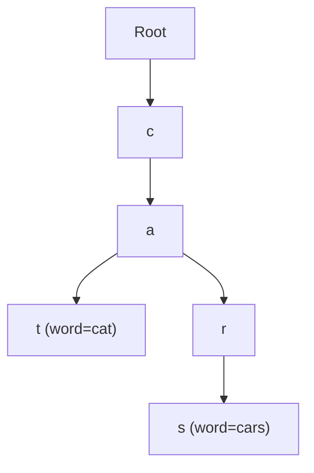

# Day 11 — Tries & Advanced RAG with pgvector

> **Timebox: ~2.75 hours.** DSA practice (60m) → Deep-dive read (75m — long doc) → Recall & write-up (30m).
> Last day of Week 2. Tomorrow is the system-design crucible begins. Today's RAG content is heavily probed in interviews — go deep, not wide.

---

## 1. Algorithmic Canvas — Tries

A **trie** (prefix tree) is the right structure when you need fast prefix lookups: autocomplete, spell-check, IP routing, and — relevant for this role — **token-level inverted indexes for hybrid search**. The performance is `O(L)` per operation (where L = key length), independent of the dictionary size.

### Problem 1 — [Implement Trie (LC #208)](https://leetcode.com/problems/implement-trie-prefix-tree/) — *Medium*

**Target:** `O(L)` time per `insert`/`search`/`startsWith`. Space: `O(N × L × |Σ|)` worst case, much less in practice with shared prefixes.

```java
class Trie {
    private final TrieNode root = new TrieNode();

    public void insert(String word) {
        TrieNode node = root;
        for (char c : word.toCharArray()) {
            node = node.children.computeIfAbsent(c, k -> new TrieNode());
        }
        node.isEnd = true;
    }

    public boolean search(String word)        { return find(word, true);  }
    public boolean startsWith(String prefix)  { return find(prefix, false); }

    private boolean find(String s, boolean exact) {
        TrieNode node = root;
        for (char c : s.toCharArray()) {
            node = node.children.get(c);
            if (node == null) return false;
        }
        return !exact || node.isEnd;
    }

    private static class TrieNode {
        Map<Character, TrieNode> children = new HashMap<>();
        boolean isEnd;
    }
}
```

**Trade-off:** `HashMap` per node is flexible but has overhead. For a fixed alphabet (e.g. `[a-z]`), use `TrieNode[26]`: ~3-4× faster lookups, lower memory.

---

### Problem 2 — [Word Search II (LC #212)](https://leetcode.com/problems/word-search-ii/) — *Hard*

**Target:** `O(m·n·4^L)` worst case, but the trie reduces practical runtime by **pruning**: if no word in your dictionary starts with the current prefix, abandon that DFS branch immediately.

**Key insight:** insert all words into a trie, then DFS the board carrying a *trie pointer* alongside the position. The trie pointer tells you both "is this still a valid prefix?" and "did we just complete a word?".

```java
public List<String> findWords(char[][] board, String[] words) {
    TrieNode root = buildTrie(words);
    List<String> result = new ArrayList<>();
    for (int r = 0; r < board.length; r++) {
        for (int c = 0; c < board[0].length; c++) {
            dfs(board, r, c, root, result);
        }
    }
    return result;
}

private void dfs(char[][] b, int r, int c, TrieNode node, List<String> out) {
    if (r < 0 || r >= b.length || c < 0 || c >= b[0].length) return;
    char ch = b[r][c];
    if (ch == '#') return;
    TrieNode next = node.children.get(ch);
    if (next == null) return;                       // ← trie-based pruning

    if (next.word != null) {                        // word found
        out.add(next.word);
        next.word = null;                           // dedupe
    }
    b[r][c] = '#';
    dfs(b, r+1, c, next, out); dfs(b, r-1, c, next, out);
    dfs(b, r, c+1, next, out); dfs(b, r, c-1, next, out);
    b[r][c] = ch;
}
```

**Pattern visual — trie node carrying the word reference:**

Storing the full word at the terminal node (vs. a boolean `isEnd`) avoids reconstructing the path during DFS.

**Follow-ups:**
- [Design Add and Search Words (LC #211)](https://leetcode.com/problems/design-add-and-search-words-data-structure/) — trie + wildcard `.` support via DFS.
- [Replace Words (LC #648)](https://leetcode.com/problems/replace-words/) — autocomplete-style "find shortest matching prefix".

---

## 2. Engineering Deep-Dive — Advanced RAG with pgvector

**Read:** [advanced-rag.md](../../java-21-study-guide/09-ai-orchestration/advanced-rag.md)
**Companion deep-dives (skim today, deep-read during capstone work):**
- [vector-db-tradeoffs.md](../../java-21-study-guide/09-ai-orchestration/vector-db-tradeoffs.md) — pgvector vs Pinecone vs Qdrant decision matrix, HNSW tuning knobs, embedding-dimension cost-perf, multi-tenancy patterns, the decision tree in §9.
- [llm-evaluation.md](../../java-21-study-guide/09-ai-orchestration/llm-evaluation.md) — Ragas metrics (faithfulness / answer relevancy / context precision / context recall), LLM-as-judge calibration, CI integration. Without evals, every prompt change is "hope it doesn't break".

For an AI orchestrator role, naïve RAG (chunk → embed → vector search → stuff into prompt) is a **junior pattern**. Senior interviews probe: *what fails in production, and how do you fix it?*

### 5 extraction targets

1. **The two failures of naïve RAG** — (a) **Lost in the middle**: LLMs ignore the middle of long contexts, so chunk #7 of 15 might as well not exist; (b) **chunking destroys semantics**: a 500-token cut can split a key sentence in half, producing useless embeddings.
2. **Parent-document retrieval** — embed *small* (1 sentence / ~100 tokens) for accurate vector match; retrieve the *parent paragraph* (~1000 tokens) for context. Decouples *retrieval precision* from *context completeness*.
3. **HNSW index** — Hierarchical Navigable Small World graph. Approximate nearest-neighbor (ANN) search in sub-millisecond on millions of vectors. Trade-off: small recall loss vs exact search. Tune `m` (graph connectivity) and `ef_search` (query-time exploration) for recall/latency.
4. **Hybrid search** — *always* filter on relational columns (`tenant_id`, `created_at`, `status`) **before** the vector math. The query planner does this automatically with the right indexes; the alternative is computing distances against the entire table.
5. **Embedding dimensions & cost** — OpenAI `text-embedding-3-small` is 1536 dims (~$0.02/1M tokens); `text-embedding-3-large` is 3072 dims (~$0.13/1M). Storage and query time roughly double with dims. The right choice depends on retrieval recall *measured against your domain*, not benchmark numbers.

### Recall questions (close the doc)

1. Your RAG chatbot answers correctly when a topic is in chunk #1 of the retrieved 10, but wrongly when in chunk #6. Diagnose, then propose two fixes (one architectural, one prompt-engineering).
2. You chunk a 50-page PDF into 500-token pieces. Embeddings score worse than expected on Q&A. The customer says "the answer is *literally in the document*". What's likely happening, and what's the parent-document retrieval fix?
3. You've stored 5M embeddings in pgvector with no index. A query takes 30 seconds. You add a B-Tree on `tenant_id`. Latency goes to 4 seconds. You add an HNSW index. Latency goes to 80ms. Walk through *why* each step helped — what was the bottleneck before each fix?
4. Senior trap question: a teammate says "we should re-embed our corpus when we upgrade from `text-embedding-3-small` to `large`." Right or wrong? *(→ Right. Different models produce different vector spaces. You can't mix them.)*
5. Your tenant has 100M vectors. HNSW recall@10 is 0.94, latency 50ms. The product team wants 0.99 recall. What two HNSW knobs do you turn, and what's the cost?

---

## 3. Day 11 Deliverables

- [ ] `sprint/day11/Trie.java` — `HashMap`-based implementation, then a comment block showing the `TrieNode[26]` variant and the trade-off.
- [ ] `sprint/day11/WordSearchII.java` — trie + DFS, with a `// Pruning:` comment on the trie-pointer trick.
- [ ] **Obsidian note (400 words):** *"Naïve RAG → production RAG: 3 problems and the fixes I'd ship"* — go beyond what's in the syllabus. Mention re-ranking (Cohere/BGE), query expansion (HyDE), and metadata filtering.
- [ ] **Obsidian note (300 words):** *"HNSW for engineers in 5 minutes"* — explain the multi-layer-graph idea, the `m` and `ef_search` knobs, and when you'd use IVFFlat instead.
- [ ] **Hands-on (capstone-aligned):** stand up Postgres + pgvector locally (Podman: `podman run -d -p 5432:5432 pgvector/pgvector:pg16`). Create a `documents` table with `embedding vector(1536)`, ingest 100 short docs (use any embedding model — OpenAI, local Ollama, or sentence-transformers via Python). Build the HNSW index, run hybrid search filtered by metadata. Time the queries before/after the index. *This becomes part of your capstone for Week 3.*
- [ ] **Week 2 reflection:** in Obsidian, identify the 2 weakest topics from Days 6–11 and schedule a 30-min review during Day 14's slack budget.
- [ ] **Spaced-repetition tags:** `#review/day-11`, `#topic/tries`, `#topic/rag`, `#topic/pgvector`, `#topic/embeddings`. Revisit on Day 18 and Day 21.

---

## 4. References & Further Reading

**Tries**
- [NeetCode — Tries roadmap](https://neetcode.io/roadmap)
- [LeetCode editorial — Word Search II](https://leetcode.com/problems/word-search-ii/editorial/)

**RAG, vector search, embeddings**
- [pgvector GitHub README — HNSW & IVFFlat](https://github.com/pgvector/pgvector#hnsw)
- [Pinecone — Advanced RAG techniques](https://www.pinecone.io/learn/advanced-rag-techniques/)
- [OpenAI — Embedding models pricing & dimensions](https://platform.openai.com/docs/guides/embeddings)
- [Anthropic — Contextual Retrieval (2024)](https://www.anthropic.com/news/contextual-retrieval)
- [LangChain — Parent Document Retriever](https://python.langchain.com/docs/how_to/parent_document_retriever/)
- [Cohere — Re-ranking guide](https://docs.cohere.com/docs/reranking)
- [HyDE paper — *Precise zero-shot dense retrieval without relevance labels*](https://arxiv.org/abs/2212.10496)
