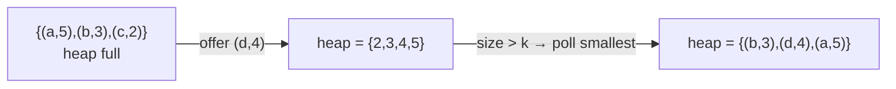

# Day 12 — Heaps & Agentic Patterns (ReAct, Semantic Caching)

> **Timebox: ~2.5 hours.** DSA practice (60m) → Deep-dive read (60m) → Recall & write-up (30m).
> Week 3 begins. The DSA topics from now on are *building blocks for system design*. Today's heap → Day 13's interval scheduling → Day 18's leaderboard system design.

---

## 1. Algorithmic Canvas — Heaps (Priority Queue)

A heap is the right answer when you need **"k-best of N"** without sorting all of N. In Java, `PriorityQueue<T>` is a binary min-heap by default. For a max-heap: `new PriorityQueue<>(Comparator.reverseOrder())`.

**Memorize the cost table:**
| Op       | Time     | Note                    |
| -------- | -------- | ----------------------- |
| `offer`  | `O(log n)` | sift-up                 |
| `poll`   | `O(log n)` | sift-down               |
| `peek`   | `O(1)`     | root                    |
| heapify  | `O(n)`     | bottom-up build         |

### Problem 1 — [Merge K Sorted Lists (LC #23)](https://leetcode.com/problems/merge-k-sorted-lists/) — *Hard*

**Target:** `O(N log k)` time (N = total nodes, k = number of lists), `O(k)` space.
**Key insight:** put each list's *head* in a min-heap keyed by `node.val`. Repeatedly pop the smallest, append it to the result, and push the popped node's `next` (if any).

```java
public ListNode mergeKLists(ListNode[] lists) {
    PriorityQueue<ListNode> pq = new PriorityQueue<>(Comparator.comparingInt(n -> n.val));
    for (ListNode head : lists) {
        if (head != null) pq.offer(head);
    }
    ListNode dummy = new ListNode(0), tail = dummy;
    while (!pq.isEmpty()) {
        ListNode min = pq.poll();
        tail.next = min;
        tail = min;
        if (min.next != null) pq.offer(min.next);
    }
    return dummy.next;
}
```

**Why `O(N log k)` not `O(N log N)`:** the heap has at most `k` elements at any time, not `N`. Tightening the upper bound is the senior signal.

---

### Problem 2 — [Top K Frequent Elements (LC #347)](https://leetcode.com/problems/top-k-frequent-elements/) — *Medium*

**Target:** `O(n log k)` time, `O(n)` space.
**Key insight:** count frequencies in a HashMap, then push every `(num, freq)` into a *bounded* min-heap of size `k`. Whenever the heap exceeds `k`, evict the smallest.

```java
public int[] topKFrequent(int[] nums, int k) {
    Map<Integer, Integer> freq = new HashMap<>();
    for (int n : nums) freq.merge(n, 1, Integer::sum);
    PriorityQueue<int[]> pq = new PriorityQueue<>(Comparator.comparingInt(a -> a[1])); // min-heap by freq
    for (var e : freq.entrySet()) {
        pq.offer(new int[]{ e.getKey(), e.getValue() });
        if (pq.size() > k) pq.poll();      // evict smallest, keep top-k
    }
    int[] result = new int[k];
    for (int i = k - 1; i >= 0; i--) result[i] = pq.poll()[0];
    return result;
}
```

**Why bounded min-heap not max-heap:** with a max-heap, you'd push all `n` items then pop `k` → `O(n log n)`. With a bounded min-heap of size `k`, you push all `n` but the heap never exceeds size `k` → `O(n log k)`. Same answer, log-factor faster.

**Pattern visual — bounded min-heap eviction (`k=3`):**


**Follow-ups:**
- [K Closest Points to Origin (LC #973)](https://leetcode.com/problems/k-closest-points-to-origin/) — bounded max-heap of size k.
- [Find Median from Data Stream (LC #295)](https://leetcode.com/problems/find-median-from-data-stream/) — *Hard*. Two heaps (max-heap of lower half + min-heap of upper half) kept balanced. Classic system-design crossover (latency-sensitive metric stream).
- [Task Scheduler (LC #621)](https://leetcode.com/problems/task-scheduler/) — heap-based alternative to Day 10's greedy.

---

## 2. Engineering Deep-Dive — Agentic Patterns

**Read:** [agentic-patterns.md](../../java-21-study-guide/09-ai-orchestration/agentic-patterns.md)

This is the second-most-probed topic after Spring AI tools (Day 10). ReAct, n8n orchestration, and semantic caching are *the* triad you'll defend in any agent system design round.

### 5 extraction targets

1. **ReAct loop** (Reasoning + Acting) — Thought → Action → Observation → Thought → ... → Final Answer. Each iteration grounds the LLM in *real* tool output, drastically cutting hallucinations vs single-shot prompting. The cost is latency: 5 tool calls = 5 LLM turns.
2. **n8n hybrid orchestration** — visual workflow tool for the "glue" (webhooks, approval steps, Slack notifications); Spring Boot owns the heavy reasoning + DB tools. Pattern: webhook → call your Spring API → AI Agent node → Wait-for-human-approval node → resume.
3. **Human-in-the-loop checkpoints** — `Wait` node with a Slack button. The workflow halts until a human clicks Approve/Reject. Critical for high-cost, high-risk actions: refunds > $X, account deletions, customer-facing email drafts.
4. **Semantic caching** — exact-match string caching fails because users phrase the same question differently. Cache the *embedding* of the query; on match (cosine similarity > ~0.95), return the stored answer. Saves $$ on LLM calls and drops latency from 2-5s to ~10ms.
5. **The cache-invalidation problem for semantic caches** — if your knowledge base updates, you must invalidate cached answers tied to that knowledge. Approaches: TTL (cheap, lossy), event-driven invalidation by `document_id` (expensive plumbing, correct), generation-tagged caches (medium).

### Recall questions (close the doc)

1. A teammate proposes: "Let the LLM make 20 tool calls in one ReAct loop to handle complex requests." Why is this brittle, and what's the senior fix? *(→ Each turn is a chance for hallucination, latency compounds, debugging is hell. Fix: explicit max-steps cap, fallback path when exceeded, and decompose into multiple smaller agents with handoffs.)*
2. Your agent calls `refundOrder(orderId, amount)`. The customer might reasonably ask the agent to do this. The interviewer asks: "What's the bare minimum architecture between user request and DB mutation?" — sketch it. *(→ Tool description gates intent; idempotency key dedupes retries; n8n Wait node + Slack approval for amounts > threshold; immutable audit log of (user msg, tool args, approver, decision).)*
3. Semantic cache hit-rate is 12%. Your boss expected 60%. What three things would you investigate? *(→ Embedding model not capturing semantic equivalence well; threshold too strict; cache populated only by *exact* prior questions, no paraphrase generation; tenant scoping fragmenting cache.)*
4. Cosine similarity 0.95 sounds like a safe threshold. Give one example where it's *too lax* and returns the wrong cached answer. *(→ "How do I cancel my subscription?" vs "How do I cancel an order?" — high cosine, completely different intents. Mitigations: per-tenant + per-intent namespaces, re-rank with a cross-encoder.)*
5. Why is n8n's Wait node strictly better than a Spring `@Scheduled` polling job for human approvals? *(→ n8n persists workflow state externally, survives restarts, has built-in audit trail and Slack/email integrations, and its `Wait` is event-driven not poll-based.)*

---

## 3. Day 12 Deliverables

- [ ] `sprint/day12/MergeKLists.java` — heap solution + a `// Alternative:` comment showing pairwise merge (`O(N log k)` either way) and when to prefer it.
- [ ] `sprint/day12/TopKFrequent.java` — bounded min-heap + a comment showing the `O(n)` Bucket Sort variant for when k can be anything up to n.
- [ ] **Obsidian note (400 words):** *"The ReAct loop, drawn end-to-end"* — one sequence diagram of a real example (e.g. "Find me an alternative for an out-of-stock SKU"), with annotations on where hallucinations *would have* occurred without the loop.
- [ ] **Obsidian note (300 words):** *"Semantic caching, the 3 trade-offs"* — cost savings vs invalidation correctness, embedding-model lift vs latency, threshold tuning vs false-positive risk.
- [ ] **Hands-on (capstone-aligned):** extend Day 11's pgvector setup with a `query_cache` table: `(query_embedding vector(1536), response TEXT, created_at, hit_count)`. Implement a Java service that checks the cache by cosine similarity > 0.95 before calling an LLM. Measure cache hit and miss latency.
- [ ] **Spaced-repetition tags:** `#review/day-12`, `#topic/heaps`, `#topic/agentic`, `#topic/react-pattern`, `#topic/semantic-cache`. Revisit on Day 19 and Day 21.

---

## 4. References & Further Reading

**Heaps**
- [NeetCode — Heap / Priority Queue roadmap](https://neetcode.io/roadmap)
- [LeetCode editorial — Find Median from Data Stream](https://leetcode.com/problems/find-median-from-data-stream/editorial/)

**Agentic patterns**
- [Yao et al. — *ReAct: Synergizing Reasoning and Acting in Language Models* (2022 paper)](https://arxiv.org/abs/2210.03629)
- [LangGraph — Building agents with state machines](https://langchain-ai.github.io/langgraph/)
- [Anthropic — *Building effective agents* (engineering blog)](https://www.anthropic.com/engineering/building-effective-agents)
- [n8n docs — AI Agent node + Wait nodes](https://docs.n8n.io/integrations/builtin/cluster-nodes/root-nodes/n8n-nodes-langchain.agent/)
- [Redis blog — *Semantic caching for LLM apps*](https://redis.io/blog/llm-semantic-caching/)
