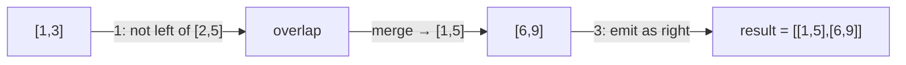

# Day 13 — Intervals & System Design Blueprint

> **Timebox: ~3 hours.** DSA practice (45m) → Deep-dive read (90m — long, do *not* skim) → Recall & write-up (45m).
> Today's deep-dive is the **5-step interview blueprint** you'll use in every system design round of Days 14–21. Memorize it cold.

---

## 1. Algorithmic Canvas — Intervals

Interval problems are about **sorting then sweeping**: nearly all of them collapse into "sort by start, walk left-to-right, decide whether the current interval extends the previous one". The senior tells:
- Always **sort first** unless the input is already sorted.
- Be explicit about closed-vs-open boundaries (`[1, 3]` and `[3, 5]`: do they overlap?).

### Problem 1 — [Merge Intervals (LC #56)](https://leetcode.com/problems/merge-intervals/) — *Medium*

**Target:** `O(n log n)` time (sort dominates), `O(n)` space for output.
**Key insight:** sort by start. Maintain a *running* merged interval. For each new one, either extend the running one or start a fresh merged interval.

```java
public int[][] merge(int[][] intervals) {
    Arrays.sort(intervals, (a, b) -> Integer.compare(a[0], b[0]));
    List<int[]> merged = new ArrayList<>();
    int[] current = intervals[0];
    for (int i = 1; i < intervals.length; i++) {
        int[] next = intervals[i];
        if (next[0] <= current[1]) {                // overlap or touch
            current[1] = Math.max(current[1], next[1]);
        } else {
            merged.add(current);
            current = next;
        }
    }
    merged.add(current);
    return merged.toArray(new int[0][]);
}
```

**The boundary call:** is `[1, 3]` and `[3, 5]` "overlapping"? On LC, the answer is yes (`<=`). In a billing system, the answer is *no* (`<`). Always state the assumption aloud.

---

### Problem 2 — [Insert Interval (LC #57)](https://leetcode.com/problems/insert-interval/) — *Medium*

**Target:** `O(n)` time (input is already sorted), `O(n)` space.
**Key insight:** three phases. (1) emit all intervals strictly left of the new one; (2) merge all that overlap; (3) emit all strictly right.

```java
public int[][] insert(int[][] intervals, int[] newInterval) {
    List<int[]> result = new ArrayList<>();
    int i = 0, n = intervals.length;
    // 1. Strictly left
    while (i < n && intervals[i][1] < newInterval[0]) result.add(intervals[i++]);
    // 2. Overlap → merge into newInterval
    while (i < n && intervals[i][0] <= newInterval[1]) {
        newInterval[0] = Math.min(newInterval[0], intervals[i][0]);
        newInterval[1] = Math.max(newInterval[1], intervals[i][1]);
        i++;
    }
    result.add(newInterval);
    // 3. Strictly right
    while (i < n) result.add(intervals[i++]);
    return result.toArray(new int[0][]);
}
```

**Pattern visual — three phases (`existing=[[1,3],[6,9]], new=[2,5]`):**


**Follow-ups:**
- [Non-overlapping Intervals (LC #435)](https://leetcode.com/problems/non-overlapping-intervals/) — sort by *end*, greedy keep earliest-ending.
- [Meeting Rooms II (LC #253)](https://leetcode.com/problems/meeting-rooms-ii/) — sweep line with a min-heap of end times. *Senior bridge to system design.*
- [Insert Interval](https://leetcode.com/problems/insert-interval/) — same template, harder boundary cases.

---

## 2. Engineering Deep-Dive — The System Design Blueprint

**Read:** [system-design-blueprint.md](../../java-21-study-guide/10-system-design-leadership/system-design-blueprint.md)

This is the *meta*-skill for Days 14–21. Every mock interview from here on uses this 5-step framework. Read the doc twice.

### 5 extraction targets

1. **Step 1 — Requirements clarification (3-5 min).** Functional ("Can users upload images?") and non-functional ("Strong consistency vs eventual? Latency budget?"). The dumbest mistake is starting to draw boxes before pinning requirements.
2. **Step 2 — Back-of-envelope estimation (3-5 min).** 10M DAU × 10 req/day = 100M/day → ~1,150 QPS avg → 3,000 QPS peak. Storage: 10M × 1MB = 10TB/day. *Memorize 86,400 seconds in a day.* These numbers shape every box you'll draw.
3. **Step 3 — High-level API + data model (5-10 min).** Define 3-5 endpoints (`POST /v1/chat/messages`, `GET /v1/sessions/{id}`); pick the storage per-table ("PostgreSQL for user profiles for ACID, Cassandra for messages for write throughput, pgvector for embeddings").
4. **Step 4 — High-level architecture (10 min).** `Client → LB → Gateway → Microservices → Cache → DB`. Separate write path from read path. Identify the *one* hot path that drives most traffic.
5. **Step 5 — Deep dive & trade-offs (15 min).** This is where staff-level candidates earn the offer. Bottlenecks ("DB is the bottleneck — read replicas + Redis"), single points of failure ("multi-AZ"), partitioning strategy ("shard by `tenant_id`"), and operational concerns (metrics, alerts, rollback plan).

### The fully-worked example to memorize cold: Multi-Tenant AI Chatbot

The syllabus's worked example is **the** capstone for this sprint. Memorize:
- 1,000 tenants × N users × WebSocket streaming.
- Tenant isolation: PostgreSQL RLS + pgvector namespacing by `tenant_id`.
- Async ingestion: PDF → RabbitMQ → embed → vector DB.
- Query path: WebSocket → ChatService → embed query → vector search filtered by tenant → prompt assembly → LLM streamed → WebSocket out.
- Cost tracking: every LLM call publishes `TokenUsageEvent` to Kafka → Billing Service aggregates.

Be ready to extend this design when probed: "what if a tenant uploads 1M docs?", "what if LLM latency spikes to 10s?", "what if a tenant's vector queries dominate the shared DB?".

### Recall questions (close the doc — answer aloud, time yourself, *2 minutes max each*)

1. **"Design a real-time multi-tenant chatbot platform for 1,000 SMB customers."** Walk all 5 steps. *(This is the warm-up for Day 15.)*
2. Without looking, give the back-of-envelope for: 10M DAU, 10 messages/user/day, 2KB per message stored. Average and peak QPS, daily storage, and 1-year storage.
3. Your interviewer says: "Your design uses PostgreSQL for chat messages." Push back gracefully — name two reasons it's the wrong choice and propose an alternative. *(→ Write throughput on hot tables; horizontal scaling. Cassandra or DynamoDB partitioned by `tenant_id` + `session_id`.)*
4. The interviewer cuts you off at the architecture step: "How would you handle a tenant whose document corpus is 100x bigger than average?". Sketch the answer in 3 sentences.
5. Name three operational items (not architecture) you'd cover in Step 5 to signal staff-level thinking. *(→ Rollout strategy & feature flags; SLO definition + paging policy; cost-per-tenant attribution & tier-based throttling.)*

---

## 3. Day 13 Deliverables

- [ ] `sprint/day13/MergeIntervals.java` — solution + a `// Boundary:` comment on the closed-vs-open question.
- [ ] `sprint/day13/InsertInterval.java` — three-phase solution + a comment on why it's `O(n)` not `O(n log n)`.
- [ ] **Obsidian note (500 words):** *"The 5-step system design blueprint, with two timing knobs"* — paste each step, write what *you* would do in each, and identify which two steps are most likely to compress under interview pressure.
- [ ] **Obsidian note (700 words):** *"Multi-tenant AI chatbot — my full system design write-up"* — write the entire worked example from memory. Cross-check against the syllabus. *Re-write any section where you missed something.* This is the capstone you'll defend in mocks.
- [ ] **Whiteboard practice (30 min):** stand at a wall and draw the multi-tenant chatbot architecture from memory, narrating each box aloud. Time yourself; aim for 12 minutes for steps 1-4 + 15 minutes for the deep-dive. **Record yourself if possible** — playing it back catches filler words.
- [ ] **Spaced-repetition tags:** `#review/day-13`, `#topic/intervals`, `#topic/system-design`, `#topic/blueprint`. Revisit on Days 14, 15, 18, 21 — this is the *most* repeated topic of the sprint by design.

---

## 4. References & Further Reading

**Intervals**
- [NeetCode — Intervals roadmap](https://neetcode.io/roadmap)
- [LeetCode editorial — Meeting Rooms II](https://leetcode.com/problems/meeting-rooms-ii/editorial/)

**System design canon**
- [Martin Kleppmann — *Designing Data-Intensive Applications*](https://dataintensive.net/)
- [Alex Xu — *System Design Interview* (ByteByteGo)](https://bytebytego.com/)
- [DDIA chapter notes (free, Henrik Warne)](https://henrikwarne.com/2017/04/05/notes-on-designing-data-intensive-applications/)
- [Donne Martin — *system-design-primer* (GitHub, free)](https://github.com/donnemartin/system-design-primer)
- [Alex Xu — *AI/ML System Design Interview* (companion volume)](https://bytebytego.com/courses/ai-ml-system-design-interview)
