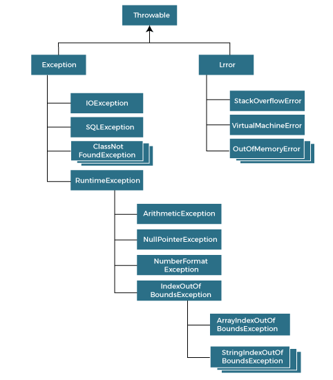

# Exception Handling

A mechanism to handle runtime errors (e.g., `ClassNotFoundException`, `IOException`, `SQLException`, etc.) to maintain the normal flow of the application.



## Types of Exceptions

1. **Checked Exceptions**: Checked by the compiler at compile-time. The programmer must either handle them using a `try-catch` block or declare them using the `throws` keyword. They inherit from the `Exception` class (excluding `RuntimeException`).
   - Example: `IOException`, `SQLException`.

2. **Unchecked Exceptions (Runtime Exceptions)**: Not checked by the compiler. These usually represent programming logic errors. They inherit from `RuntimeException`.
   - Example: `NullPointerException`, `IndexOutOfBoundsException`.

3. **Errors**: Represent serious problems that a reasonable application should not try to catch (e.g., JVM errors). Inherits from `Error`.
   - Example: `OutOfMemoryError`, `StackOverflowError`.

## Keywords

| **Keyword** | **Description** |
| --- | --- |
| `try` | Used to enclose code that might throw an exception. Must be followed by `catch` and/or `finally`. |
| `catch` | Used to handle the exception thrown by the preceding `try` block. |
| `finally` | Block executed regardless of whether an exception is handled or not. Used for cleanup operations (e.g., closing connections). |
| `throw` | Used to explicitly throw an exception within a method or block of code. |
| `throws` | Used in a method signature to declare that the method might throw one or more exceptions, passing the responsibility to the caller. |

## Try-with-Resources
Introduced in Java 7, this statement ensures that each resource is closed at the end of the statement, avoiding memory leaks. The resource must implement `AutoCloseable`.

```java
try (BufferedReader br = new BufferedReader(new FileReader("file.txt"))) {
    System.out.println(br.readLine());
} catch (IOException e) {
    e.printStackTrace();
} // br is automatically closed here
```
