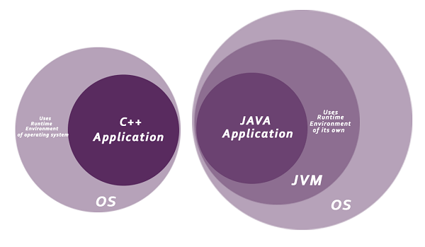

# Introduction to Java

## What is Java?
- A high-level, class-based, object-oriented programming language first released by Sun Microsystems in 1995.
- It is not a purely object-oriented language because it still uses primitive data types (like `int`, `float`, `double`).
- **"Write Once, Run Anywhere" (WORA)**: Java code compiles to bytecode, which can run on any device equipped with a Java Virtual Machine (JVM).

## Key Features

- **Object-Oriented**: Based on objects, making it easier to write and maintain complex code. Core concepts include Object, Class, Inheritance, Polymorphism, Abstraction, and Encapsulation.
- **Platform-Independent**: Compiles to platform-independent bytecode which is executed by the JVM.
- **High-Performance**: Employs Just-In-Time (JIT) compilers and, in modern versions, Ahead-Of-Time (AOT) compilation (e.g., GraalVM) for high performance.
- **Robust**: Features strong memory management, automatic garbage collection, and robust exception handling.
- **Secure**: Runs in a virtual machine sandbox. Features a Classloader (separates local filesystem classes from network sources) and a Bytecode Verifier. *(Note: The Security Manager was deprecated for removal in Java 17 via JEP 411 and should not be relied upon in modern applications.)*
- **Multi-threaded**: Built-in support for concurrent programming. (Significantly enhanced in Java 21 with Virtual Threads).

## Advantages
- **Portability**: Code runs on any JVM-equipped device.
- **Scalability**: Excellent for building large-scale, high-traffic enterprise applications.
- **Ecosystem & Community**: Massive ecosystem of libraries (Spring, Hibernate, etc.) and a very active developer community.
- **Backward Compatibility**: Strong commitment to backward compatibility across major versions.

## Disadvantages
- **Memory Consumption**: Can consume significant memory due to the JVM overhead and automatic memory management.
- **Warm-up Time**: Traditional JVMs require "warm-up" time for the JIT compiler to optimize code (though AOT compilation mitigates this).
- **Verbosity**: Historically more verbose than languages like Python, though modern Java (Records, `var`, Switch Expressions) has drastically reduced boilerplate.
