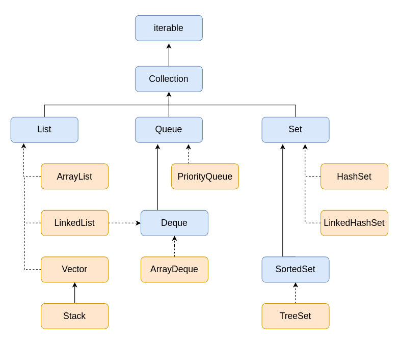

# Collection Framework

The Java Collections Framework provides an architecture to store and manipulate a group of objects. It includes interfaces, implementations (classes), and algorithms.



## 1. Core Interfaces and Classes

### 1.1 `Iterable` and `Iterator` Interfaces
- **`Iterable`**: The root interface for all collection classes (except Maps). It contains the `iterator()` method.
- **`Iterator`**: Provides the facility to iterate over elements. Methods include `hasNext()`, `next()`, and `remove()`.

### 1.2 `Collection` Interface
- The foundation interface implemented by all classes in the collection framework (excluding Maps).
- Declares generic methods like `add()`, `remove()`, `clear()`, `size()`, `isEmpty()`.

### 1.3 `List` Interface
- Stores an ordered collection of objects.
- Allows duplicate values.
- **`ArrayList`**: Uses a dynamic array. Fast for random access. Non-synchronized.
- **`LinkedList`**: Uses a doubly-linked list. Fast for insertions and deletions.
- **`Vector` / `Stack`**: Legacy, synchronized collections. Stack is LIFO.

### 1.4 `Set` Interface
- Represents an unordered collection of unique elements (no duplicates).
- **`HashSet`**: Backed by a Hash Table. Unordered.
- **`LinkedHashSet`**: Maintains insertion order.
- **`TreeSet`**: Implements `SortedSet`. Maintains elements in ascending order.

### 1.5 `Queue` and `Deque` Interfaces
- **`Queue`**: Typically First-In-First-Out (FIFO).
- **`PriorityQueue`**: Orders elements based on their priority (natural ordering or a Comparator).
- **`Deque`**: Double-ended queue. Elements can be inserted/removed from both ends.
- **`ArrayDeque`**: Resizable-array implementation of the Deque interface. Faster than Stack and LinkedList.

### 1.6 `Map` Interface (Not a true Collection)
- Stores data in Key-Value pairs. Keys must be unique.
- **`HashMap`**: Fast, unordered key-value storage.
- **`LinkedHashMap`**: Maintains insertion order.
- **`TreeMap`**: Sorts entries by key.

---

## 2. Modern Collections Features (Java 9 - Java 21)

### Factory Methods (Java 9)
Provides a convenient way to create unmodifiable collections.

```java
List<String> list = List.of("A", "B", "C");
Set<String> set = Set.of("A", "B");
Map<String, Integer> map = Map.of("A", 1, "B", 2);
```

### Sequenced Collections (Java 21)
Java 21 introduced new interfaces (`SequencedCollection`, `SequencedSet`, `SequencedMap`) to represent collections that have a defined encounter order. They provide standard methods to access the first and last elements, and to obtain a reversed view of the collection.

```java
SequencedCollection<String> seqList = new ArrayList<>(List.of("A", "B", "C"));

seqList.addFirst("Start");
seqList.addLast("End");

System.out.println(seqList.getFirst()); // Start
System.out.println(seqList.getLast());  // End

// Reversed View
SequencedCollection<String> reversed = seqList.reversed();
```

---

## 3. Collections vs. Streams

| **Streams** | **Collections** |
| --- | --- |
| Operates on the source data structure. Does **not** store data. | Stores and holds all the data in a particular data structure. |
| Supports functional programming via lambda expressions. | Uses traditional imperative programming models. |
| Consumable: Traversed only once. Must be re-created to traverse again. | Non-consumable: Can be iterated multiple times. |
| Supports easy parallel processing (`parallelStream()`). | Thread-safe parallel processing requires explicit synchronization or concurrent classes. |
| Elements are iterated internally. | Elements are iterated externally using loops or iterators. |
| Data cannot be modified (added/removed) directly in the stream. | Data can be easily added to or removed from the collection. |
