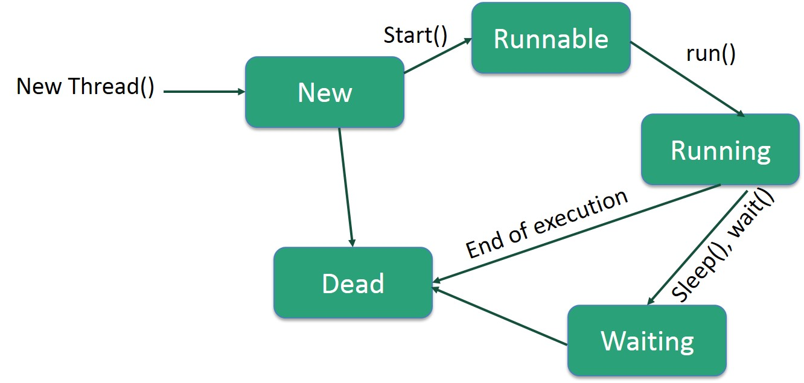

# Multithreading & Virtual Threads

Java has robust built-in support for concurrent programming, enabling the execution of multiple threads concurrently to maximize CPU utilization.



## 1. Thread Lifecycle
1. **New**: A thread is created but the `start()` method hasn't been invoked yet.
2. **Runnable**: A thread is ready to run and waiting for CPU time.
3. **Running**: The thread scheduler has selected it, and it is currently executing.
4. **Blocked/Waiting**: The thread is waiting for a lock or for another thread to perform a task (e.g., waiting for I/O).
5. **Timed Waiting**: The thread is waiting for a specified interval (e.g., `Thread.sleep(1000)`).
6. **Terminated**: The thread completes its execution or aborts due to an exception.

## 2. Traditional Threads (Platform Threads)
Traditionally, Java threads are mapped 1:1 to OS threads. This makes them expensive to create and context-switch.

### Creating Threads
**Option 1: Implementing `Runnable` (Preferred)**
```java
Runnable task = () -> System.out.println("Running...");
Thread thread = new Thread(task);
thread.start();
```

**Option 2: Extending `Thread`**
```java
class MyThread extends Thread {
    public void run() { System.out.println("Running..."); }
}
new MyThread().start();
```

### Thread Pools (`ExecutorService`)
To avoid the overhead of creating and destroying OS threads repeatedly, Thread Pools reuse existing threads.

```java
try (ExecutorService executor = Executors.newFixedThreadPool(5)) {
    for (int i = 0; i < 10; i++) {
        executor.submit(() -> System.out.println("Task executed by: " + Thread.currentThread().getName()));
    }
} // executor automatically shuts down here (Java 19+)
```

---

## 3. Modern Concurrency: Virtual Threads (Java 21)

Introduced in Project Loom, **Virtual Threads** are lightweight threads managed by the JVM rather than the Operating System. They allow you to write synchronous, blocking code that scales massively.

- **Low Overhead**: You can create millions of virtual threads without running out of memory.
- **Blocking is Cheap**: When a virtual thread blocks (e.g., waiting for an HTTP response or DB query), the JVM transparently unmounts it from the underlying carrier (OS) thread, freeing the OS thread to execute other virtual threads.

### Creating Virtual Threads
```java
// Using a builder
Thread vThread = Thread.ofVirtual().name("v-thread").start(() -> {
    System.out.println("Running in virtual thread: " + Thread.currentThread());
});

// Using ExecutorService optimized for Virtual Threads
try (var executor = Executors.newVirtualThreadPerTaskExecutor()) {
    for (int i = 0; i < 10_000; i++) {
        executor.submit(() -> {
            // This blocking call is cheap!
            Thread.sleep(Duration.ofSeconds(1)); 
            return "Result";
        });
    }
} // Waits for all 10,000 tasks to complete
```

### The Pinning Problem
While Virtual Threads are cheap to block, **Pinning** occurs if you block a Virtual Thread while inside a `synchronized` block or method.
- When this happens, the Virtual Thread cannot unmount from its OS Carrier Thread.
- This blocks the actual OS thread, defeating the purpose of Virtual Threads.
- **The Fix**: Replace `synchronized` blocks with `ReentrantLock` when performing blocking I/O inside the critical section. The Virtual Thread can safely unmount while holding a `ReentrantLock`.

## 4. Structured Concurrency (Preview in Java 21)
Treats multiple concurrent tasks running in different threads as a single unit of work. It streamlines error handling and cancellation, improving reliability and observability.

```java
Response handleRequest() throws ExecutionException, InterruptedException {
    try (var scope = new StructuredTaskScope.ShutdownOnFailure()) {
        Supplier<String> user  = scope.fork(() -> fetchUser());
        Supplier<Integer> order = scope.fork(() -> fetchOrder());

        scope.join();           // Join both subtasks
        scope.throwIfFailed();  // Propagate errors if any subtask failed

        // Both succeeded
        return new Response(user.get(), order.get());
    }
}
```

## 5. Virtual Threads Pitfall: ThreadLocal & Scoped Values

When using Virtual Threads at scale (millions of concurrent threads), **`ThreadLocal`** and **`InheritableThreadLocal`** become dangerous:
	- Each virtual thread inherits a full copy of `InheritableThreadLocal` values, causing **extreme memory bloat** with millions of threads.
- Libraries like SLF4J's MDC (used for Correlation IDs) use `ThreadLocal` internally, which may not propagate correctly across virtual thread boundaries.

### Scoped Values (Preview in Java 21)
Java 21 introduced **`ScopedValue`** as a lightweight, immutable replacement for `ThreadLocal` in virtual thread contexts.

```java
// Define a ScopedValue (immutable, automatically cleaned up)
private static final ScopedValue<String> TENANT_ID = ScopedValue.newInstance();

// Bind it for the scope of a task
ScopedValue.where(TENANT_ID, "tenant-123").run(() -> {
    System.out.println(TENANT_ID.get()); // "tenant-123"
    // Automatically available in child virtual threads
});
```

> **Interview Tip**: If asked about Virtual Threads, always mention the ThreadLocal pitfall and ScopedValues. This shows you understand the real-world operational challenges beyond the basic API.
