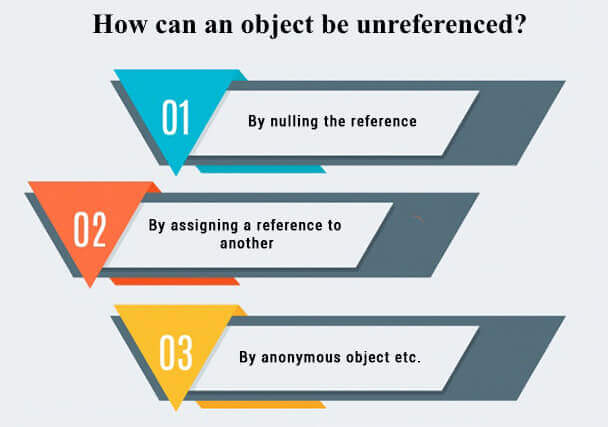
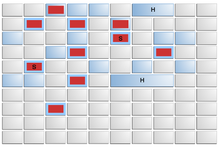

# Garbage Collection

Garbage Collection (GC) is the process of automatically reclaiming runtime unused heap memory by destroying unreferenced objects. It is performed by a daemon thread called the Garbage Collector.

## How Objects Become Unreferenced
- By nulling the reference: `employee = null;`
- By assigning a reference to another object: `e1 = e2;`
- Anonymous objects: `new Employee();`

---

## Modern Garbage Collectors in Java 21

Historically, Java used Parallel GC and Concurrent Mark Sweep (CMS). **CMS was deprecated in Java 9 and removed in Java 14**. Today, the focus is on highly concurrent, low-latency collectors.

### 1. G1 Garbage Collector (Default)
G1 (Garbage-First) is the default GC since Java 9. It is designed for multi-processor machines with large memories.
- **Region-based**: Divides the heap into equally sized regions (~2048). Young/Old generations are logical, not contiguous.
- **Garbage-First Strategy**: Prioritizes collecting regions that contain the most garbage to maximize efficiency.
- **Humongous Objects**: Objects > 50% of a region's size go straight to old gen. Frequent humongous allocations are very bad for G1 performance.
- **Tuning**: Don't manually tune heap generation sizes! Tune the target instead: `-XX:MaxGCPauseMillis=200` (default). If it misses the target, it automatically shrinks the young generation.

### 2. ZGC (Z Garbage Collector)
ZGC is a highly scalable, extremely low-latency garbage collector.
- **Sub-millisecond Pauses**: Pause times do not increase with heap size. It uses colored pointers (64-bit only) and load barriers to perform concurrent compaction.
- **Generational ZGC (Java 21)**: Java 21 introduced Generational ZGC as an **opt-in feature**. It separates young and old objects, drastically improving performance and lowering CPU overhead compared to single-generation ZGC. You must explicitly enable it with both flags.
- **Enable via**: `-XX:+UseZGC -XX:+ZGenerational`
- *Note: In Java 23+, generational mode became the default when using `-XX:+UseZGC`, and non-generational ZGC was deprecated.*

### 3. Shenandoah GC
Similar to ZGC, Shenandoah is an ultra-low-pause-time garbage collector maintained by Red Hat.
- It performs concurrent compaction using Brooks pointers (forwarding pointers) while Java threads are still running.
- **Enable via**: `-XX:+UseShenandoahGC`

---

## GC Methods (Warning)

- `System.gc()` or `Runtime.getRuntime().gc()`: **Suggests** to the JVM that it should run the garbage collector. The JVM is free to ignore this request. It is generally considered a bad practice to call this manually in production code.
- `finalize()`: **Deprecated in Java 9** and strongly discouraged. Historically used for cleanup before an object is collected. Modern Java uses `java.lang.ref.Cleaner` or `try-with-resources` for resource management.
