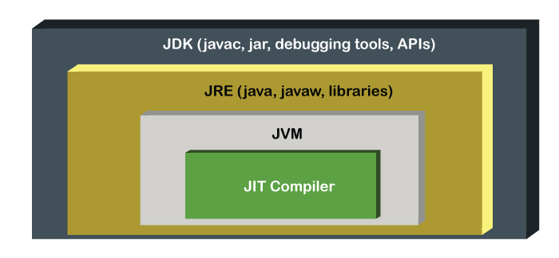

# JDK, JRE, and JVM

Understanding the differences between the Java Development Kit (JDK), Java Runtime Environment (JRE), and Java Virtual Machine (JVM) is foundational.



## 1. JDK (Java Development Kit)
- **Purpose**: Used by developers to **write and build** Java applications.
- **Contains**: Everything in the JRE, plus development tools like the compiler (`javac`), archiver (`jar`), documentation generator (`javadoc`), and debugging tools.

## 2. JRE (Java Runtime Environment)
- **Purpose**: Used to **run** Java applications.
- **Contains**: The JVM, core Java class libraries (like `java.lang`, `java.util`), and other components necessary to execute bytecode.
- *Note: Starting with Java 11, Oracle stopped shipping a standalone JRE. Developers use tools like `jlink` to create custom, highly optimized runtime images containing only the modules their application needs.*

## 3. JVM (Java Virtual Machine)
- **Purpose**: The engine that actually **executes** the Java bytecode line by line.
- **Contains**: Classloaders, Execution Engine (Interpreter + JIT), Memory Areas, and the Garbage Collector.

---

## Interacting with the Runtime Environment

The `java.lang.Runtime` class allows Java applications to interface with the environment in which they are running.

| Method | Description |
| --- | --- |
| `Runtime.getRuntime()` | Returns the singleton instance of the Runtime class. |
| `exit(int status)` | Terminates the current virtual machine. |
| `availableProcessors()` | Returns the number of processors available to the JVM. |
| `freeMemory()` | Returns the amount of free memory in the JVM. |
| `totalMemory()` | Returns the total amount of memory in the JVM. |
| `addShutdownHook(Thread hook)`| Registers a new thread to run just before the JVM shuts down. |

### Shutdown Hooks
Useful for cleanup operations (closing DB connections, file handles) before the JVM terminates (e.g., via Ctrl+C, `System.exit()`, or normal termination).

```java
Runtime.getRuntime().addShutdownHook(new Thread(() -> {
    System.out.println("JVM is shutting down. Cleaning up resources...");
}));
```
