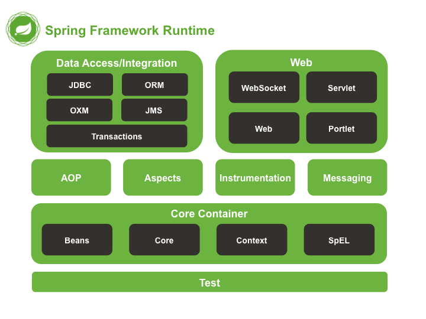

# Spring Framework & Ecosystem

Spring is a powerful, lightweight framework that provides comprehensive infrastructure support for developing Java applications. The core concept of Spring is to make developing J2EE applications easier based on the Plain Old Java Object (POJO) model.

## Core Principles
1. **Inversion of Control (IoC)**: Objects do not create their dependencies. Instead, they declare what they need, and the IoC container injects those dependencies at runtime.
2. **Dependency Injection (DI)**: The mechanism used to implement IoC. It promotes loose coupling, making code easier to test and maintain.
3. **Aspect-Oriented Programming (AOP)**: Allows the separation of cross-cutting concerns (like logging, security, and transaction management) from the main business logic.

## Advantages
- **Loose Coupling**: Achieved via DI.
- **Easy Testing**: Dependencies can be easily mocked.
- **Lightweight**: POJO implementation means it is non-invasive.
- **Declarative Support**: Simplifies caching, validation, transactions, and formatting.
- **Boilerplate Reduction**: Provides templates (`JdbcTemplate`, `RestTemplate`) that hide repetitive low-level code.



---

## Modern Spring: Spring Boot 3 & Spring 6

The modern standard for building Spring applications is **Spring Boot**, which builds on top of the Spring Framework.

### Key Features of Spring Boot 3 / Spring 6
- **Java 17 Baseline**: Spring 6 requires Java 17 as a minimum, but it fully supports and embraces Java 21 features (like Virtual Threads and Records).
- **Auto-configuration Internals**: Boot 3.x moved away from `spring.factories` to `META-INF/spring/org.springframework.boot.autoconfigure.AutoConfiguration.imports`. 
  - **Building a Custom Starter**: You typically create a `spring-boot-starter-xxx` (dependencies only) and a `xxx-autoconfigure` module.
  - You expose configurations via `@ConfigurationProperties` and conditionally load beans using `@ConditionalOnClass`, `@ConditionalOnMissingBean`, and `@ConditionalOnProperty`.
- **Native Image Support (GraalVM AOT)**: Spring Boot 3 introduced first-class support for Ahead-Of-Time (AOT) compilation using GraalVM. This allows Spring applications to be compiled into native standalone executables, providing:
    - Instant startup times (milliseconds instead of seconds).
    - Drastically reduced memory footprint.
    - Ideal for microservices, Serverless architectures, and Kubernetes deployments.
- **Jakarta EE**: Transitioned from `javax.*` packages to `jakarta.*` packages (e.g., `jakarta.persistence`, `jakarta.servlet`).
- **Observability**: Built-in support for Micrometer Tracing (replacing Spring Cloud Sleuth) for comprehensive metrics and distributed tracing.

### Project Ecosystem
- **Spring MVC**: Building standard web applications and REST APIs.
- **Spring WebFlux**: Building fully reactive, non-blocking applications.
- **Spring Data**: Unifies and simplifies database access (JPA, MongoDB, Redis, etc.).
- **Spring Security**: Robust, highly customizable authentication and access-control framework.
- **Spring Cloud**: Tools for building distributed systems and microservices architectures.
- **Spring Batch**: Lightweight, comprehensive framework for robust batch applications.

---

## Deep Dive: The Bean Lifecycle
Understanding the exact sequence of how Spring creates beans is critical:
1. **BeanDefinition Parsing**: Spring scans for `@Component`/`@Configuration` to create `BeanDefinition` objects.
2. **BeanFactoryPostProcessors**: Runs to modify definitions (e.g., resolving `${properties}`).
3. **Instantiation**: The bean is instantiated via its constructor.
4. **Dependency Injection**: Properties and dependencies are populated.
5. **BeanPostProcessors (Before)**: `postProcessBeforeInitialization` handles annotations like `@PostConstruct`.
6. **Initialization**: `InitializingBean.afterPropertiesSet()` and custom `init-method` run.
7. **BeanPostProcessors (After)**: `postProcessAfterInitialization` wraps the bean in an AOP Proxy if required (e.g., for `@Transactional`).
   - **JDK Dynamic Proxy**: Used if the bean implements an interface. It proxies the interface.
   - **CGLIB Proxy**: Default in Spring Boot. It subclasses the target class. This is why private methods cannot be proxied (they cannot be overridden).
8. **Destruction**: On shutdown, `@PreDestroy`, `DisposableBean.destroy()`, and `destroy-method` run.

---

## Deep Dive: The `@Transactional` Proxy Trap
Spring manages transactions using AOP Proxies. A common pitfall is the **Self-Invocation Bypass**.

```java
@Service
public class OrderService {
    
    // Will NOT start a transaction!
    // The external caller invokes the proxy, but this internal call bypasses the proxy.
    public void processOrder() {
        saveToDatabase(); // Calling internal method directly!
    }

    @Transactional
    public void saveToDatabase() { ... }
}
```
**Fixes**:
1. Refactor the transactional method to another service.
2. Self-injection (Spring 4.3+ supports injecting the service into itself).

### Transaction Propagation Levels
- **`REQUIRED`** (Default): Join an existing transaction if one exists, else create a new one. (Covers 95% of cases).
- **`REQUIRES_NEW`**: Suspend the current transaction and start a brand new, independent one. (Perfect for Audit Logs that must persist even if the main transaction fails).
- **`NESTED`**: Creates a JDBC Savepoint. If the nested transaction fails, it rolls back *only* to the savepoint. The main transaction can catch the exception and still commit!

### Read-Only Optimization
If a method only reads data, always use `@Transactional(readOnly = true)`.
- **Hibernate**: Sets the flush mode to `MANUAL`, disabling dirty checking, saving CPU and memory.
- **Database**: In PostgreSQL, it executes `SET TRANSACTION READ ONLY`, which can safely route queries to read-replicas.
