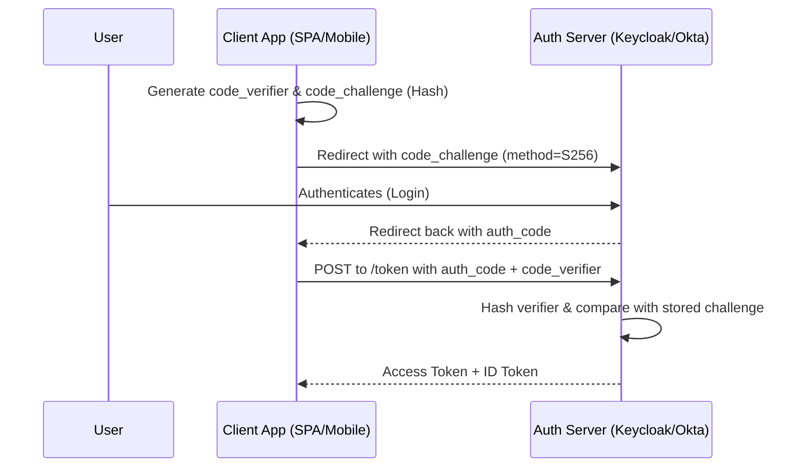

# OAuth 2.0 & JWT Cryptography

Modern backend systems rarely rely on session cookies. Instead, they use token-based authentication via OAuth 2.0 and OpenID Connect (OIDC).

## 1. OAuth 2.0 Flows

### Authorization Code + PKCE (Proof Key for Code Exchange)
The most secure flow for SPAs (Single Page Applications) and Mobile Apps. It prevents interception of the Authorization Code on public clients.

1. **Client** generates `code_verifier` (a random string) and a `code_challenge` (a SHA-256 hash of the verifier).
2. **Client** redirects the user to the **Auth Server** with the `code_challenge` and `method=S256`.
3. **User** logs in. The Auth Server stores the `code_challenge` and redirects back to the Client with an `auth_code`.
4. **Client** sends a backend POST to the token endpoint with the `auth_code` AND the original plain-text `code_verifier`.
5. **Auth Server** hashes the `code_verifier` and compares it to the stored `code_challenge`. If they match, the server returns the Access Token.

### Client Credentials
Used for Machine-to-Machine (M2M) communication (e.g., Service A calling Service B).
- The client authenticates directly with its `client_id` and `client_secret`.
- No user is involved.
- **Optimization**: The client should cache the token until `expires_in - 5 minutes` to avoid spamming the Auth Server.

### Token Exchange (RFC 8693)
Used for impersonation and delegation.
- If Service A receives a token representing the User, and Service A needs to call Service B *on behalf of* the User, Service A can exchange its token for a new token explicitly scoped for Service B.

---

## 2. JWT Cryptography: JWS vs JWE

A JSON Web Token (JWT) is just a standard for transmitting claims. It comes in two primary forms:

### JWS (JSON Web Signature)
Format: `header.payload.signature`
- **Purpose**: Integrity and Authenticity.
- **Visibility**: The payload is merely Base64-encoded. **ANYONE can decode and read it.**
- **Rule**: NEVER put PII (Emails, SSNs, phone numbers) inside a JWS.
- **Algorithms**:
  - `RS256`: RSA Signature with SHA-256 (Common, but keys are large).
  - `ES256`: ECDSA using P-256 curve and SHA-256 (Preferred. Shorter keys, faster signature generation).

### JWE (JSON Web Encryption)
Format: `header.encryptedKey.iv.ciphertext.tag`
- **Purpose**: Confidentiality, Integrity, and Authenticity.
- **Visibility**: The payload is fully encrypted. Only the Resource Server with the private decryption key can read it.
- **How it works (Key Encapsulation)**:
  1. The Auth Server generates a random symmetric Content Encryption Key (CEK).
  2. The Auth Server encrypts the payload using the CEK (e.g., `A256GCM`).
  3. The Auth Server encrypts the CEK using the Resource Server's public RSA key (e.g., `RSA-OAEP-256`).
  4. The Resource Server receives the JWE, uses its private key to decrypt the CEK, and then uses the CEK to decrypt the payload.

### Nested JWTs
A JWS inside a JWE.
1. The token is signed first (proving who issued it).
2. The signed token is then encrypted (hiding the contents).

---

## 3. References & Further Reading
- [RFC 7636: Proof Key for Code Exchange (PKCE)](https://datatracker.ietf.org/doc/html/rfc7636)
- [RFC 8693: OAuth 2.0 Token Exchange](https://datatracker.ietf.org/doc/html/rfc8693)
- [RFC 7515: JSON Web Signature (JWS)](https://datatracker.ietf.org/doc/html/rfc7515)
- [RFC 7516: JSON Web Encryption (JWE)](https://datatracker.ietf.org/doc/html/rfc7516)
